# Minecraft - вход
## Шаг 1. Вводим логин и пароль, которые вы получили от менеджера при регистрации.
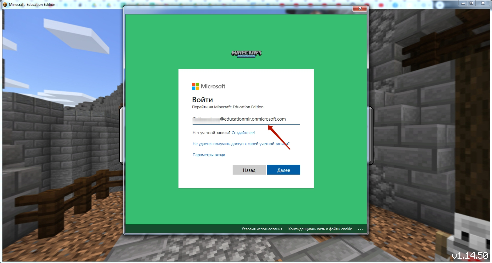

## Шаг 2. Выбираем поле "Играть"

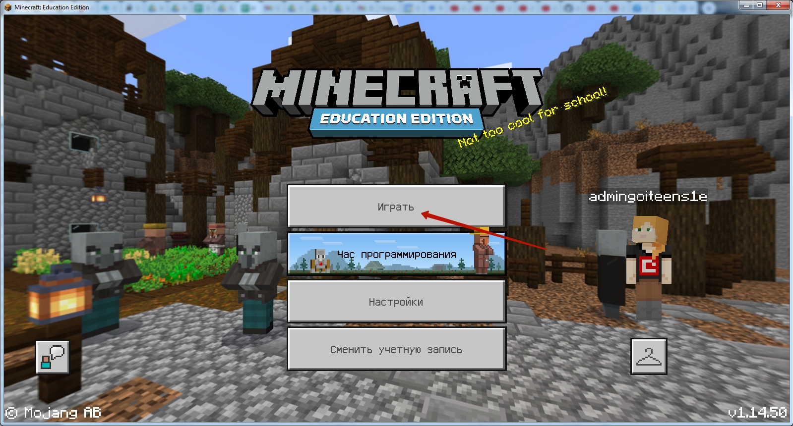

## Шаг 3. Создаем новый мир

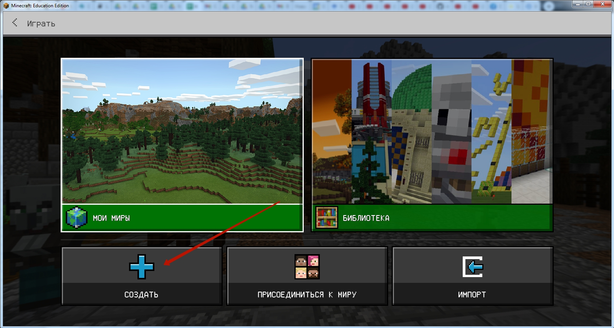  
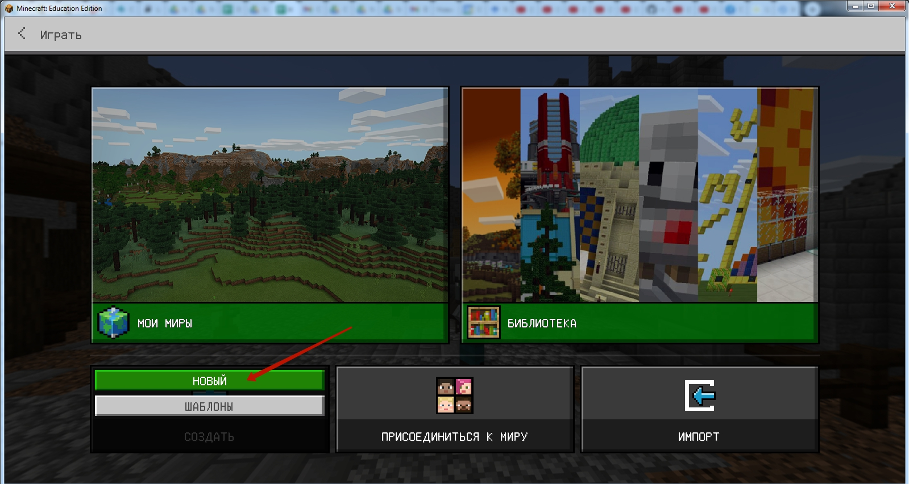

## Шаг 4. Настраиваем новый мир

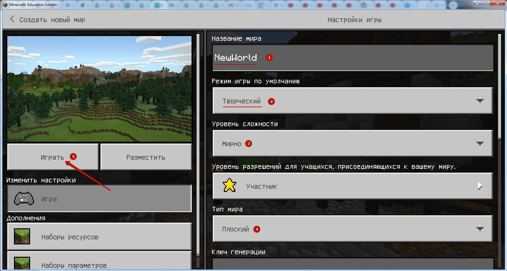

* Пишем название  
* Режим игры: **Творческий**
* Уровень сложности: **Мирно**
* Тип мира: **Плоский**
После настройки - нажимаем кнопку **"Играть"**

## Шаг 5. Включаем редактор кода (Code Builder)  

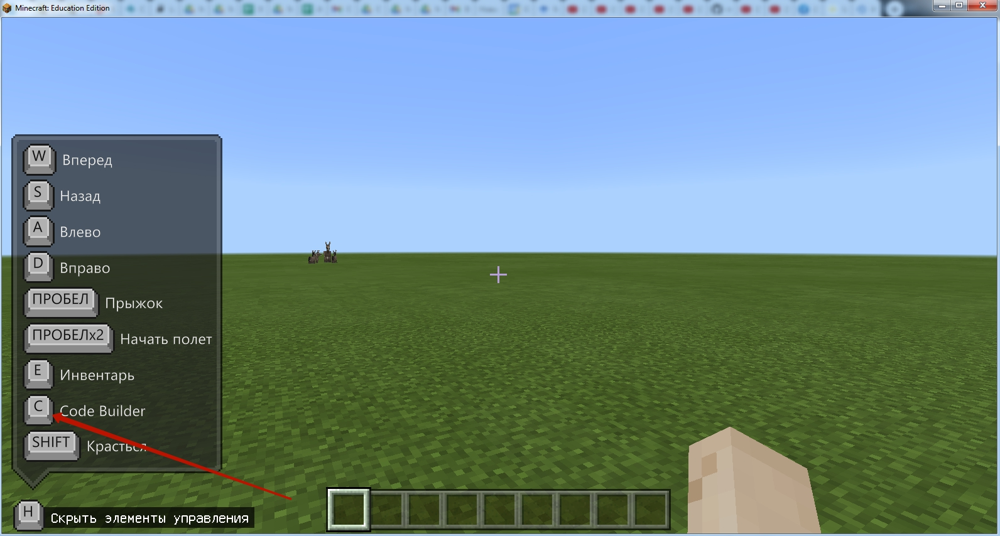  

Нажимаем кнопку **C**  
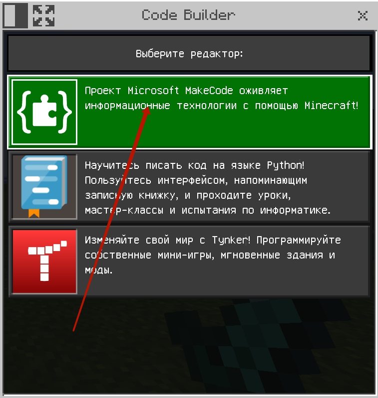  
Выбираем режим **"Microsoft Make Code"** - верхний в списке.  

## Шаг 6. Импортируем Код  
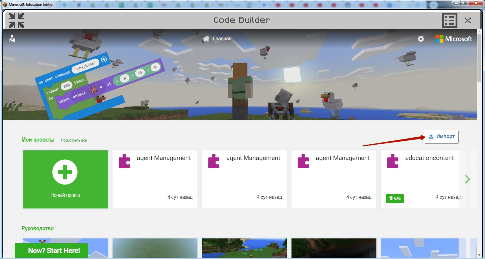  
6.1. Нажимаем кнопку "Импорт"  

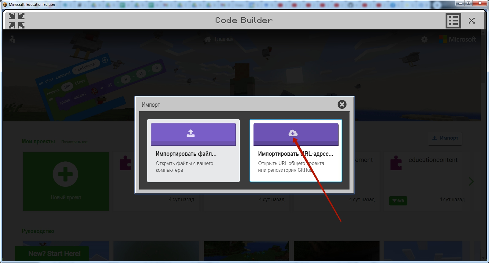  

6.2. Выбираем блок "Импортировать URL-адрес"   

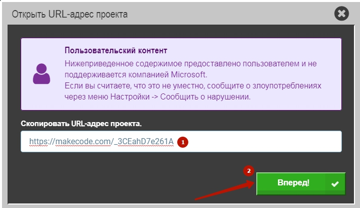  

6.3. Вставляем ссылка на код:  
https://makecode.com/_YHHH0fAvqDVj

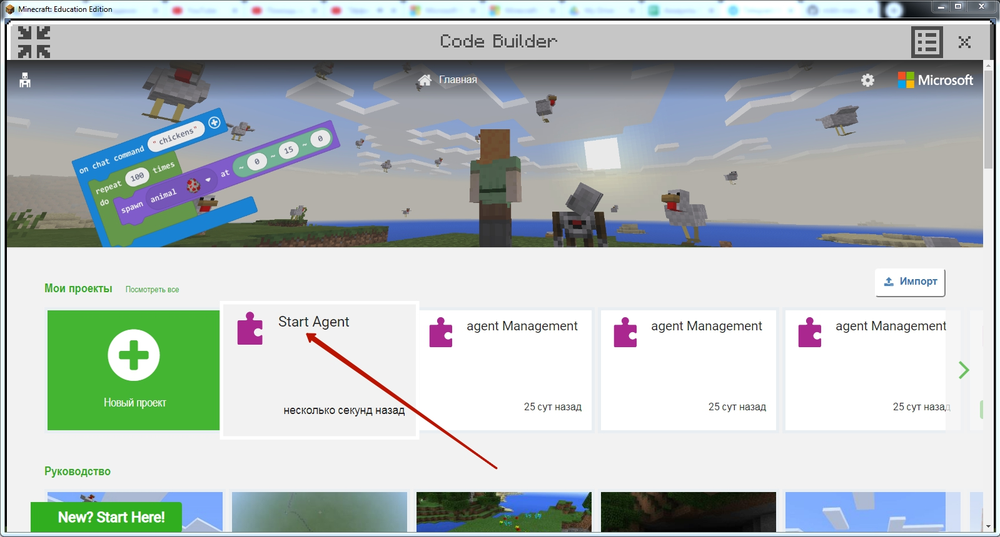  
6.4. Выбираем блок agent Management

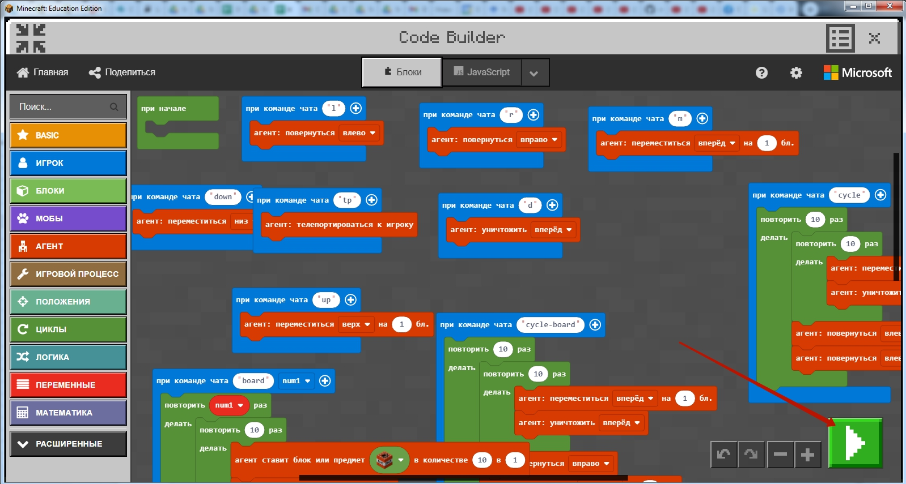  
6.5. Запускаем полученный код

