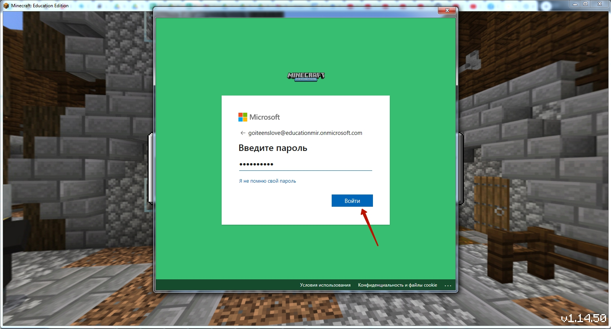
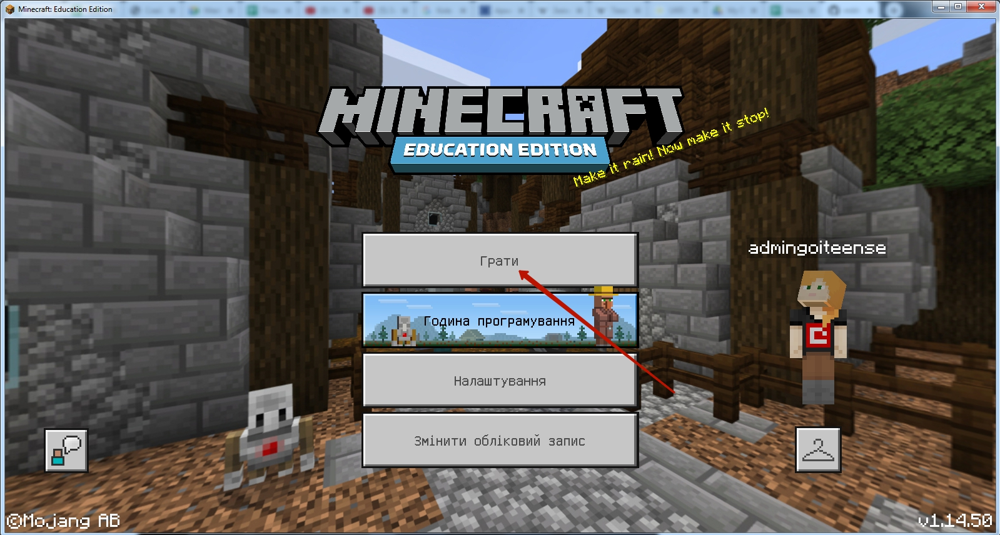
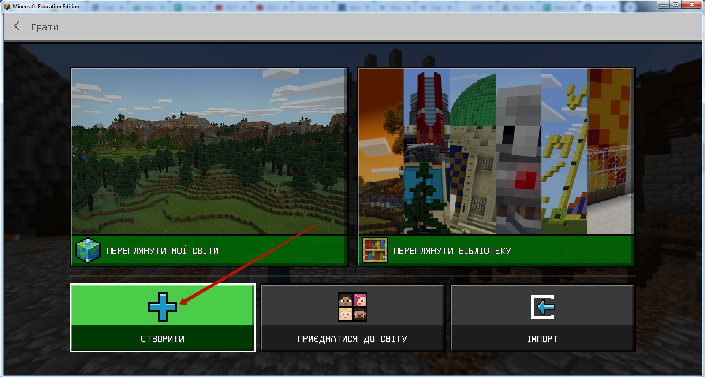
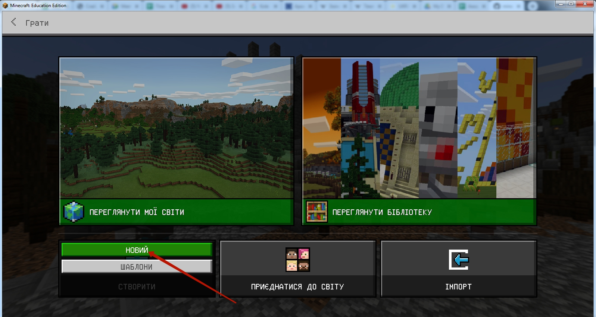
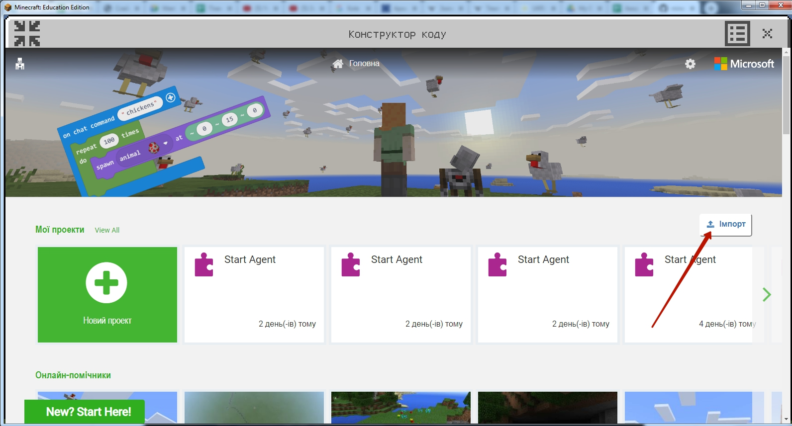
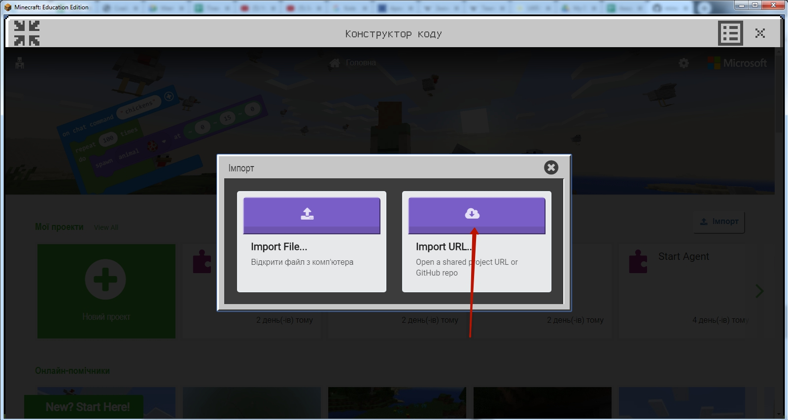
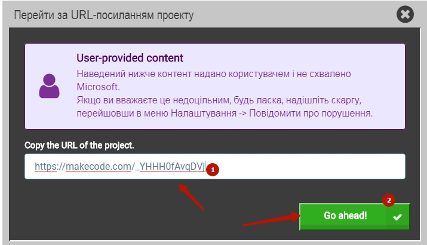
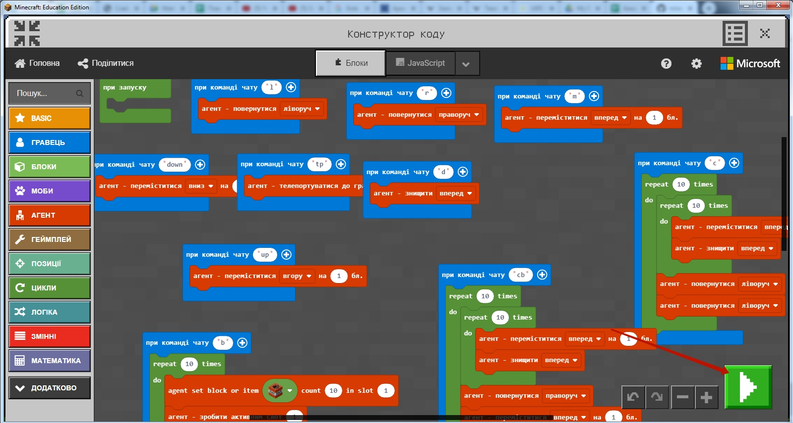

# Minecraft - вхід
## Крок 1. Вводимо логін і пароль, які ви отримали від менеджера при реєстрації.

## Крок 2. Обираємо поле "Грати"

## Крок 3. Створюємо новий світ

  

## Крок 4. Налаштовуємо новий світ

* Пишемо назву 
* Режим гри: **Творчий**
* Рівень складності: **Мирно**
* Тип світу: **Плаский**
Після настройки - натискаємо кнопку **"Грати"**

## Крок 5. Включаємо редактор коду (Code Builder) 

  

Нажимаємо кнопку **C**  
  
Обираємо режим **"Microsoft Make Code"** - верхній в списку.

## Шаг 6. Імпортуємо Код 
  
6.1. Натискаємо кнопку "Імпорт" 

  

6.2. Обираємо блок "Імпортувати URL-адресу" 

  

6.3. Вставляємо посилання на код:
https://makecode.com/_YHHH0fAvqDVj

  
6.4. Запускаємо отриманий код

