# Разработка игр (GameDev). Пробное занятие.
## Шаг 1. Сайт Unity
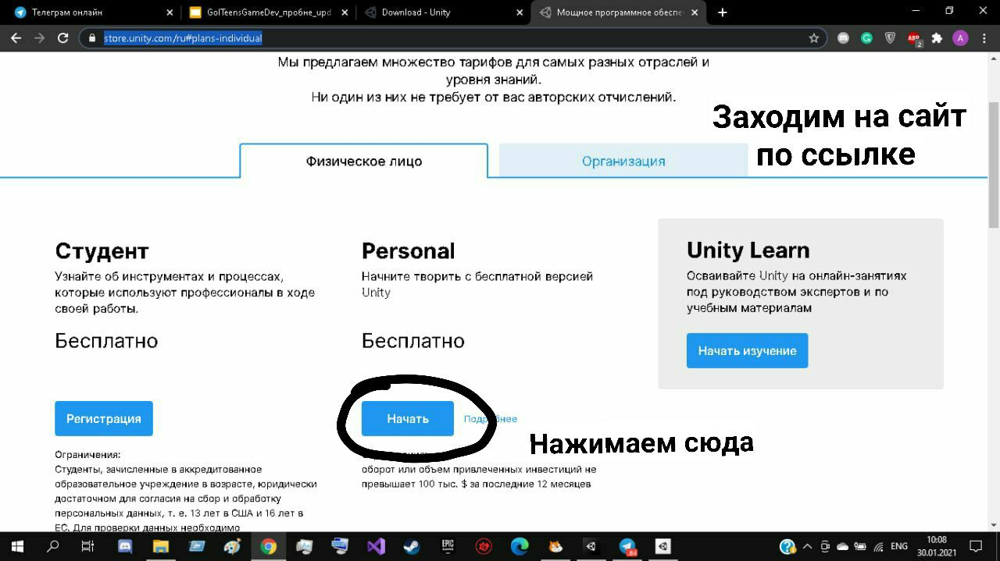
<a href = "https://store.unity.com/ru#plans-individual">https://store.unity.com/ru#plans-individual</a>  

## Шаг 2. Выбор загрузки
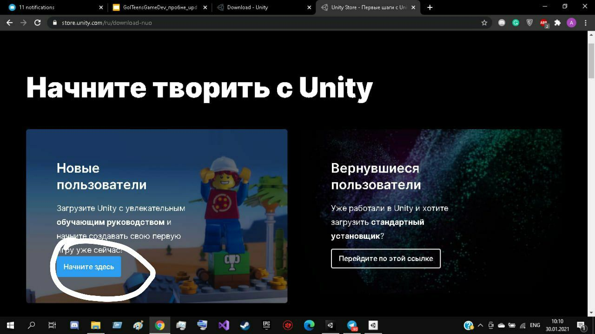

## Шаг 3. Подтверждение условий
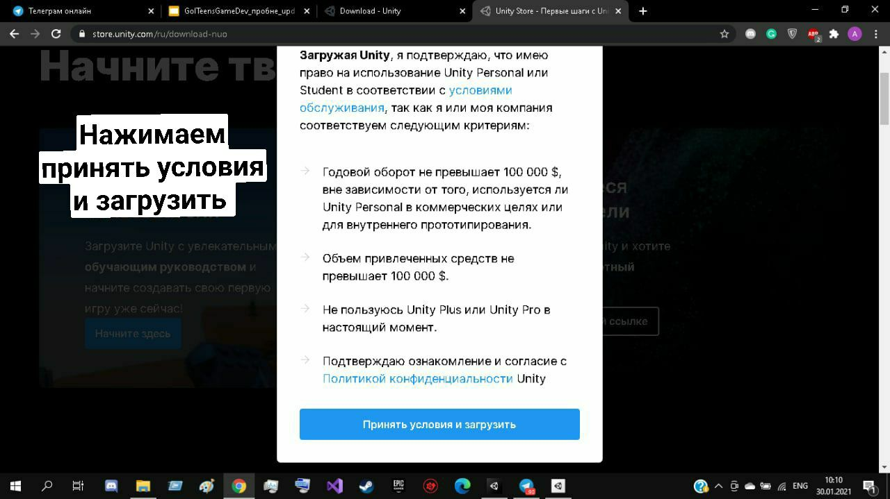

## Шаг 4. Скачиваем мастер установки Unity hub и запускаем его.
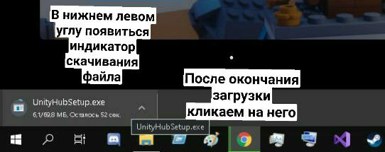

## Шаг 5. Принимаем лицензионное соглашение
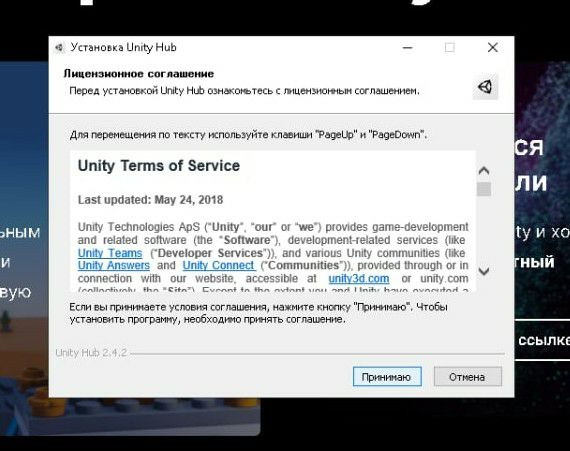

## Шаг 6. Выбираем папку для установки
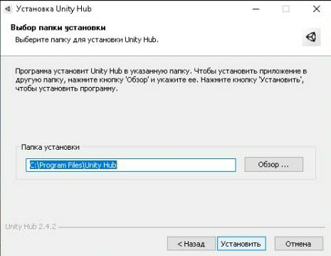

## Шаг 7. Завершаем установку и запускаем Unity Hub.
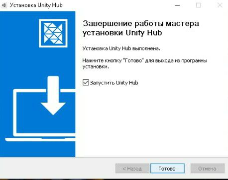

## Шаг 8. Разрешаем Unity Hub доступ к сетям.
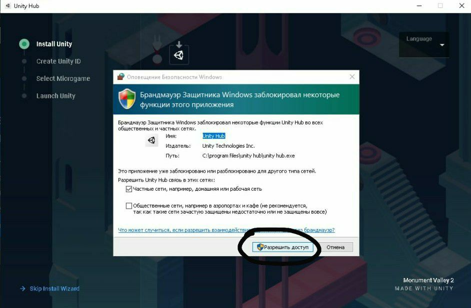

## Шаг 9. Устанавливаем Unity
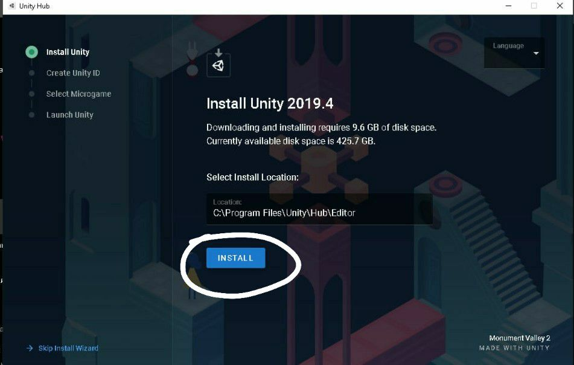

## Шаг 10. Создаем учетную запись в Unity-сообществе
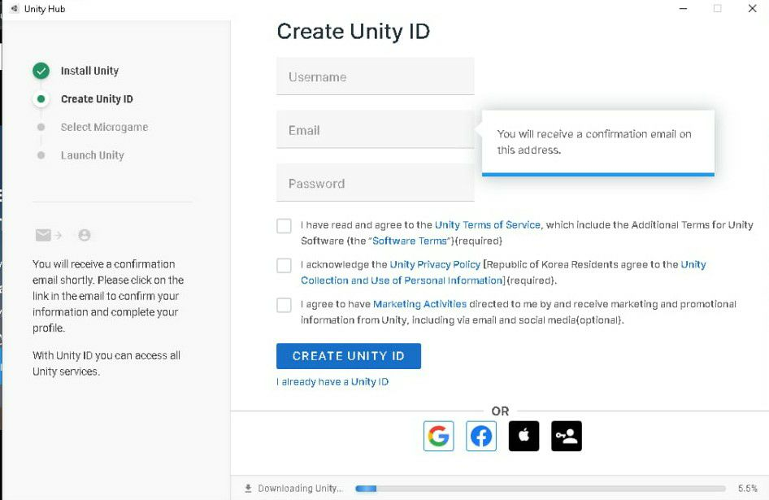

## Шаг 11. Выбираем микроигру
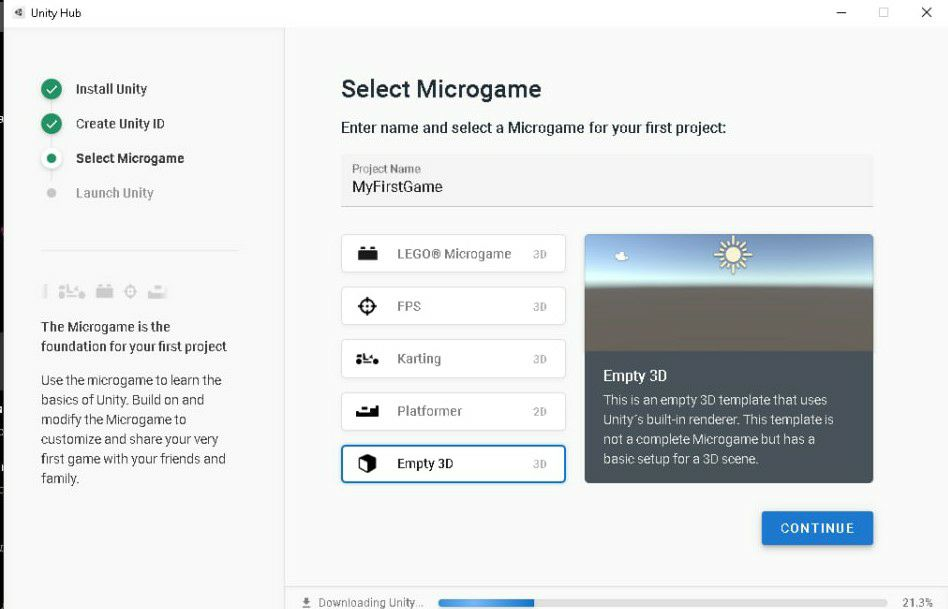

## Шаг 12. Скачиваем.
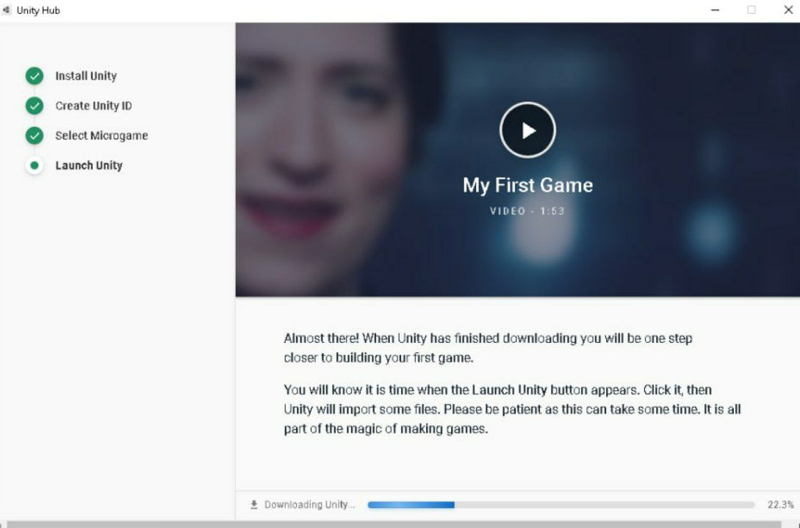

## Шаг 13. Запускаем Unity
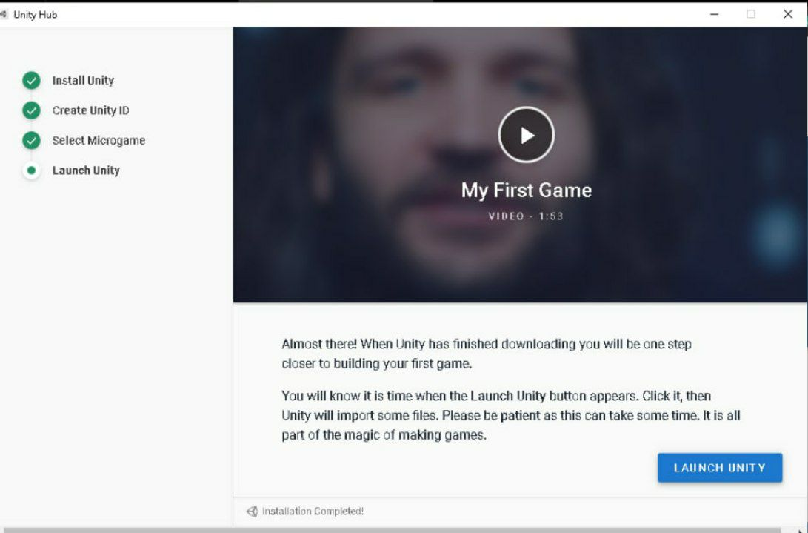

## Шаг 14. На рабочем столе появится два ярлыка. 
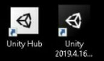

## Шаг 15. Запускам Unity Hub.
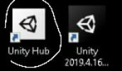

## Шаг 16. Скачиваем проекты, распаковываем папку
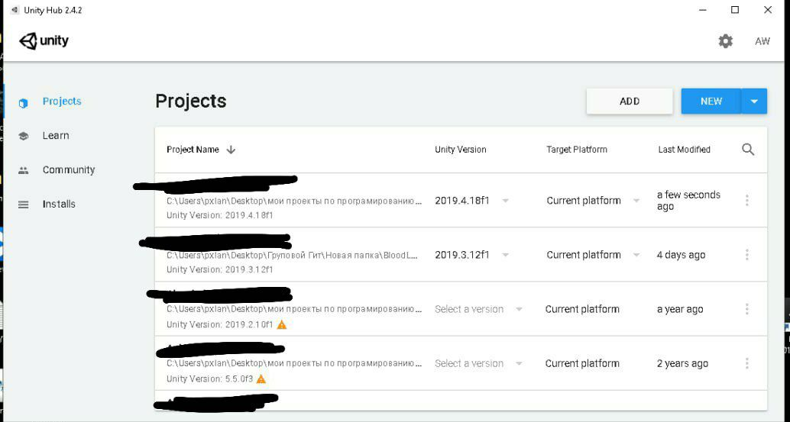
<a href = "https://drive.google.com/file/d/1Vm6a-9tghtK3_-kOADApmq0sjMGac8_A/view?usp=sharing">Project.zip</a>

## Шаг 17. Добавляем проекты в Unity
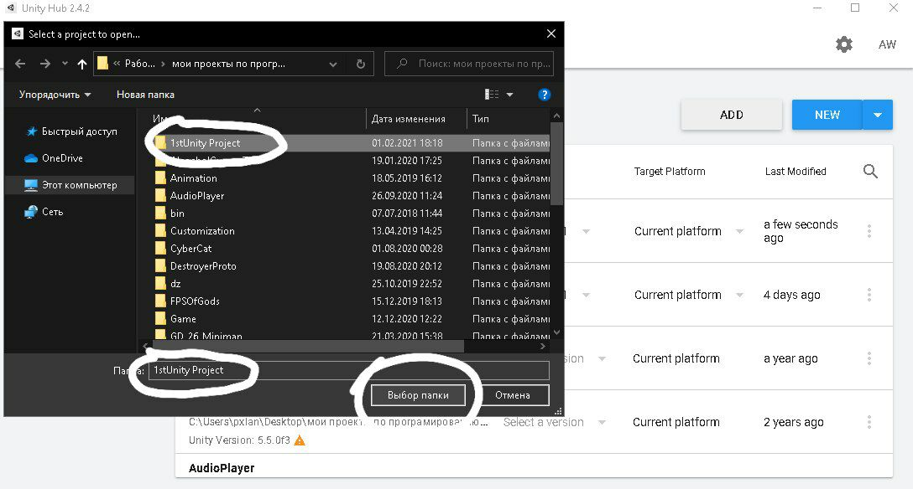

## Шаг 18. Запускаем проект 1stUnity Project.
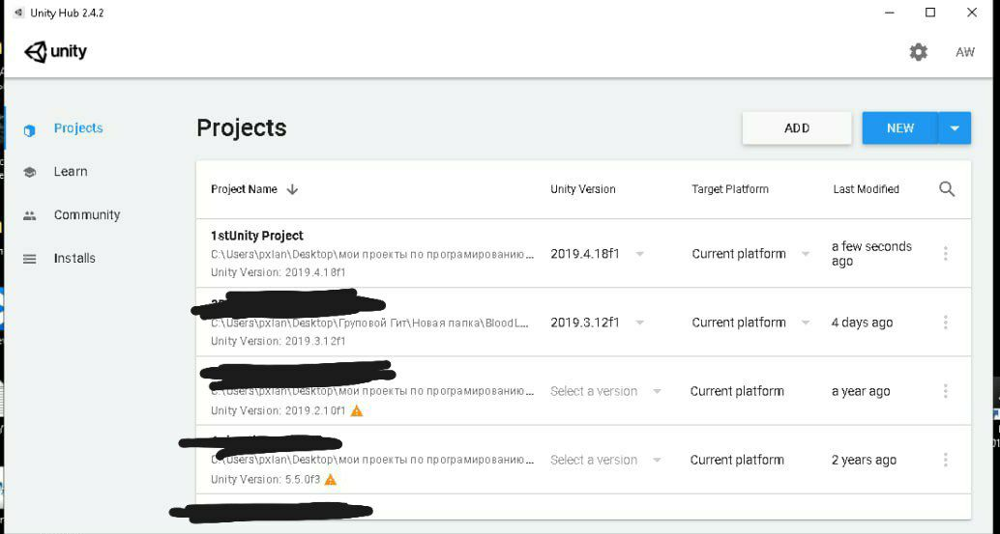

## Шаг 19. Результат.
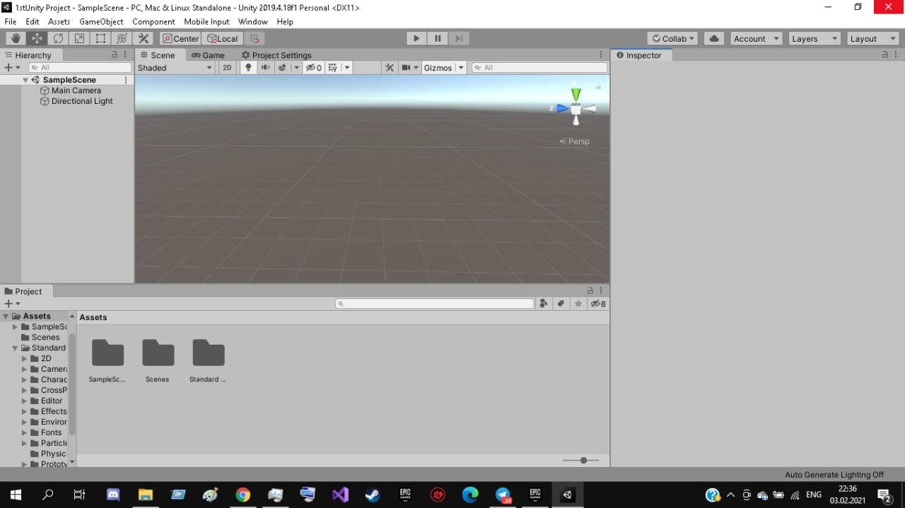
