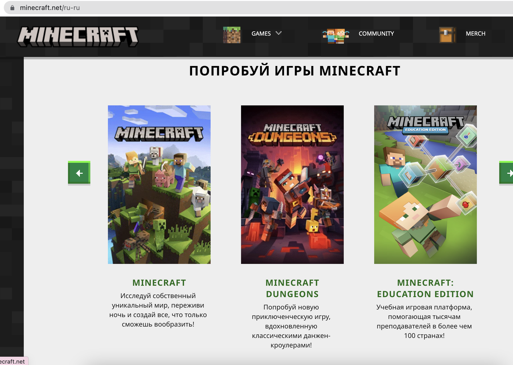
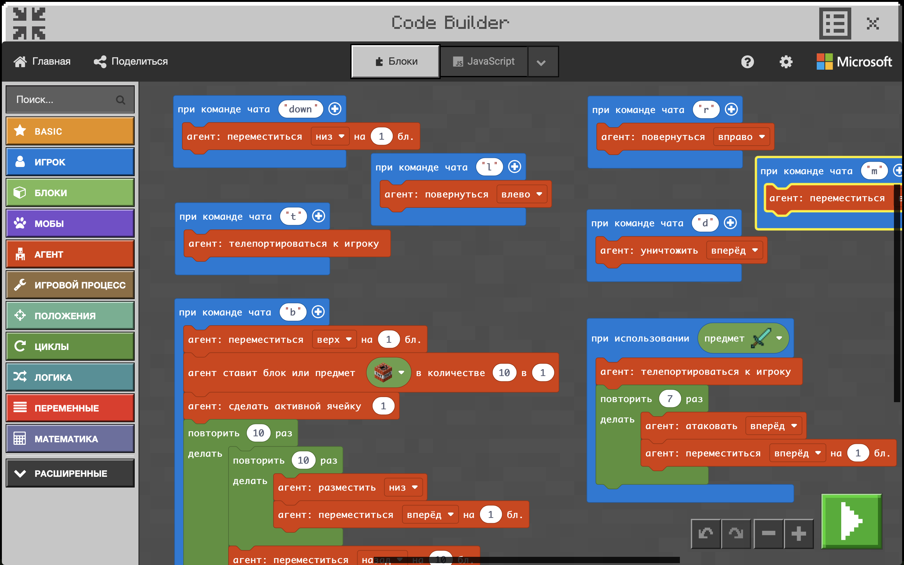

# Майнкрафт
Пробное занятие по программированию в среде **Minecraft Education**. 

**Minecraft Education** - это официальный продукт разработчика игры **Minecraft**, имеющий все те же свойства что и основная игра, а также - возможность программировать.

## Подготовительная часть
На пробном занятии - знакомимся с особенностями программирования в Minecraft. Для этого до занятия мы просим установить <a href = "https://education.minecraft.net/ru-ru/get-started/download">Minecraft Education</a> с официального сайта. И установить материалы для урока <a href = "https://github.com/mikh-maksi/minecraft-probe">согласно инструкции</a>.

## Описание занятия
### Задание 1
На занятии участники знакомятся с возможностями программировать в **Minecraft** - для начала используют программный код и учатся его запускать: в результате специальный игровой персонаж в Minecraft выполнит запрограммированные действия и создаст прямоугольник из блоков динамита. И участник сможет эти блоки подровать, используя зажигалку.  
Первая часть занятия позволяет всем ребятам адаптироваться к тому, что теперь в Minecraft они могут не только строить конструкции из блоков своим персонажем, но и программировать своего помошника - агента.  
### Задание 2  
После того, как ребята познакомились с возможностями программирования - на занятии мы пишем их первую программу: она запускается при использованием игрока железной лопаты: агент телепортируется к игроку и пробегая 7 блоков вперед - атакует. Т.е. агент помогает игроку в активных действиях в Майнкрафте.  
### Задание 3  
Написанная программа всегда хорошо запоминается, когда используется. Игрок используя лопату призывает агента, а он, в свою очередь, выбигает из-за спины игрока и отгоняет от него коровок или хрюшек, которые бегают по карте.  
  
## Что дает Minecraft Education
**Minecraft** - это массовое увлечение современных детей. При этом - это очень полезная игра, которая развивает техническое творчество, знакомит ребят с особенностями мира: как предметы создаются, что из палок можно сделать лестницу, а из камней - построить дом и даже позволяют выучить основы химии. **Minecraft** сам по себе это как самый модный конструктор лего и основы столярного дела в компьютере. И это очень хорошо, ведь по **Minecraft**  записано большое количество популярных роликов, его можно обсудить с друзьями и вообще - это можно.    
А в версии **Minecraft Education** дети могут, работая в их любимой вселенной изучать программирование. При этом начальный интерес к игре перекладывается на программирование элементов в ней. До 2000-х дети программирование учили с использованием черепашки, в 2010-х для этого самым увлекательным редактором был Scratch, сегодня самым популярным инструментом для изучения детьми программирования является **Minecraft Educaton**    
## А зачем пробный урок?  
На пробном уроке ваш ребенок сможет начать писать свою историю успеха, ведь для успеха обычно достаточно захотеть делать то, что востребовано. И именно для этого мы проводим наши пробные - чтобы самый востребованный и высокооплачиваемый навык (программирование) дети захотели изучать с удовольствием.  
  
Помогите вашем ребенку стать успешным - ждем его на пробном занятии! 
