# Python-start
**Описание курса:** данный курс позволит вам освоить основы программирования на языке программирования  и создать несколько телеграм-ботов на языке программирования **Python**.   
Такой подход обусловлен тем, что одним из самых эффективных способов обучения является проектное обучение: создавая телеграм-боты с различной функуиональность вы очень хорошо разберетесь с основами программирования.  
## Как будет проходить обучение:
1. Вы подписываетесь на бота
2. Бот отправляем вам приветственное сообщение и информирует о дате старта.
3. Начиная с даты старта каждый день в 16:00 вам будет приходить ссылка на задачи в Python-тренажере: специальной программе, которая использует технологию автопроверки, чтобы вы сразу получали инфомацию о том, на сколько правильно вы выполнили задание.
4. Если вы не сделали задачи предыдущего дня в 10:00 вам будет приходить напоминание.
5. При выполнении вами всех задач текущего дня - телеграм-бот отправит вам ссылку на описание практического задания: реализации телеграм-бота, которая использует такие структуры программирования, которые вы изучали, решая задачи в Python-тренажере.
6. На 7 день - вы посетите вебинар, посвященный сферам применения Python, особенностей создания ботов и инструментам эффективного обучения.

## Как работает Python-тренажер:
1. В левой части экрана вы видите теорию: описание конструкций языка, владение которыми позволяет выполнить задание
2. Внизу левой части экрана вы увидите задание, которое необходимо выполнить.
3. В правой части экрана вы увидите поле для программирования: в нем уже написана часть кода программы и для выполнения задания вам необходимо дописать оставшуюся часть.
4. После того, как вы написали код - нажмите кнопку **"Проверить"**
5. После нажатия кнопки **"Проверить"** в нижней правой части экрана будет указан результат проверки вашего задания: сообщения красного цвета описывают ошилку, которую вы допустили при написании программы, сообщения зеленого цвета сигнализируют о правильно выполннном задании.
6. В правой нижней части также выводится информация, которую выполняемая программа передает в консоль (с помощью команды print)
7. После правильно выполнения задания нажмите на кнопку "Следующий вопрос"
8. Через 3 минуты после открытия задания для вас становится доступным видеоподсказка.

## Графическое описание
Старт подключения к курсу начинается с лендинга:
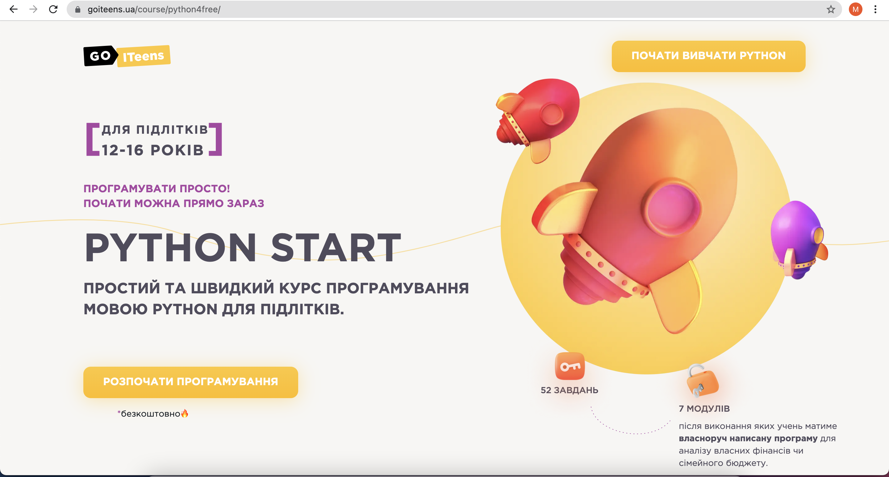   
Нажав на кнопку "Начать программирование" перед вами появится форма регистрации:
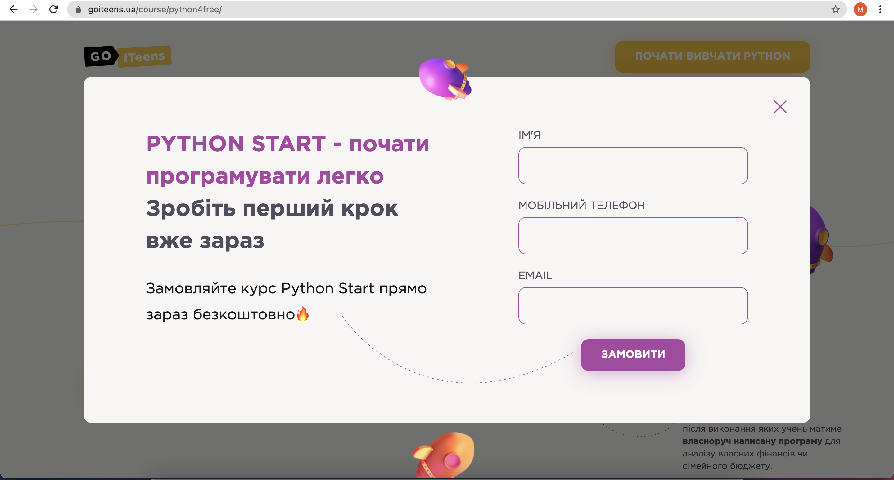   
Введя свои данные
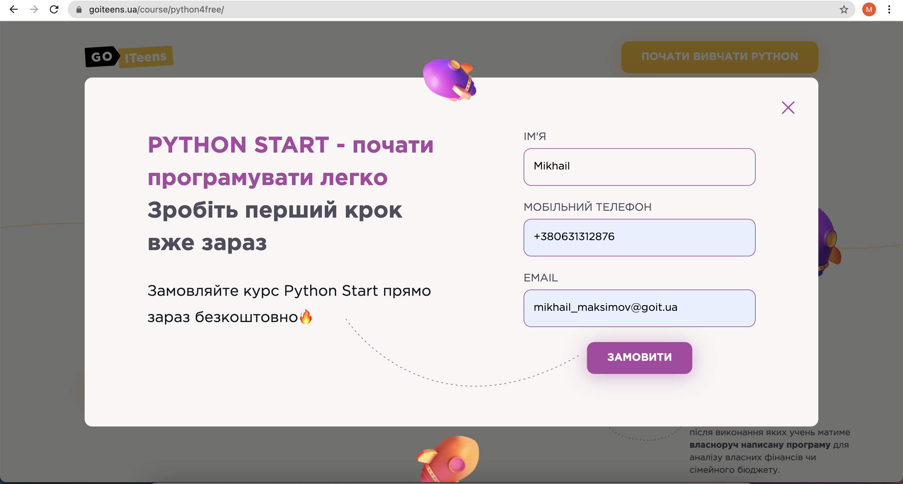   
Вам необходимо подождать несколько секунд пока запрос будет отправлен на сервер
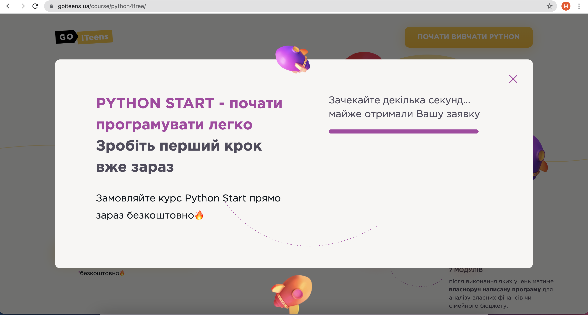   
После того, как вы будете зарегистрированы перед вами появится стартовая страница курса, на которой вам необходимо нажать кнопку "Перейти у бот"
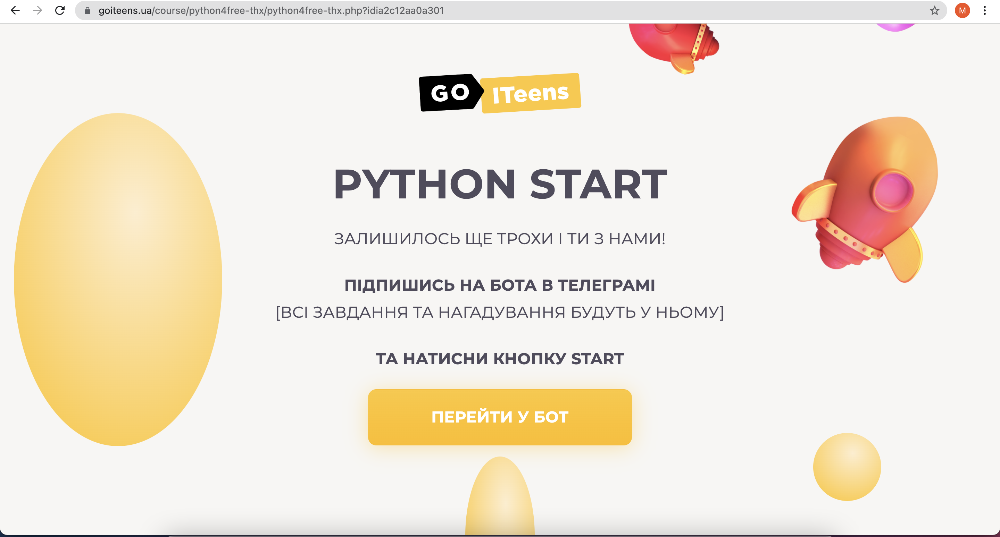   
Когда вы нажали на эту кнопку перед вами появится стандартная страница подписки на бота. Если у вас не установлен на компьютере Телеграм в виде программы вы можете воспользоваться Web-версией (нажав на кнопку "Open in web")
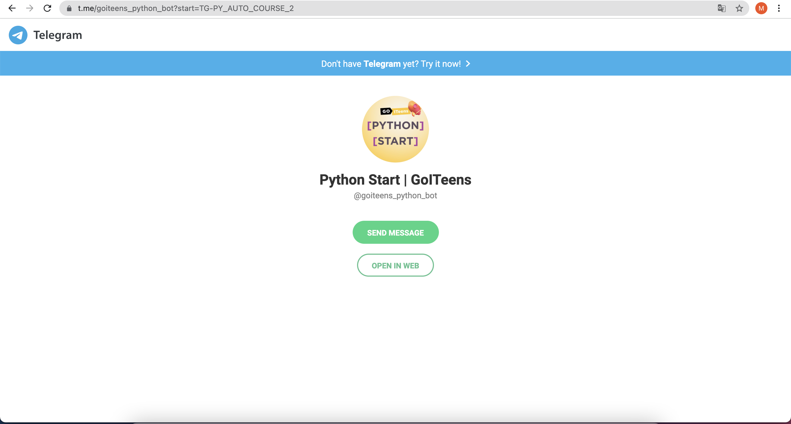   
Если Телеграм как отдельная программа установлен на вашем компьютере - он откроется автоматически и вам нобходимо нажать кнопку "Start"
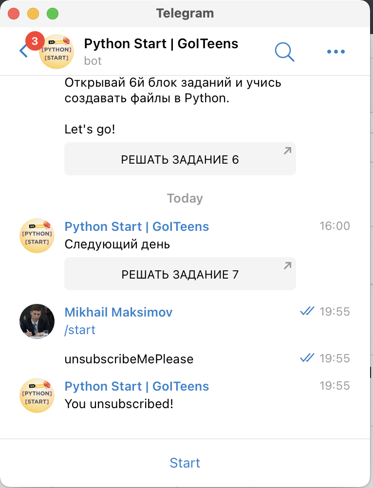   

После нажатия кнопки **"Start"** Вам прийдет первое сообщение. В нем будет общее описание действий и ссылка на первый блок заданий (кнопка "Решать задание №1")
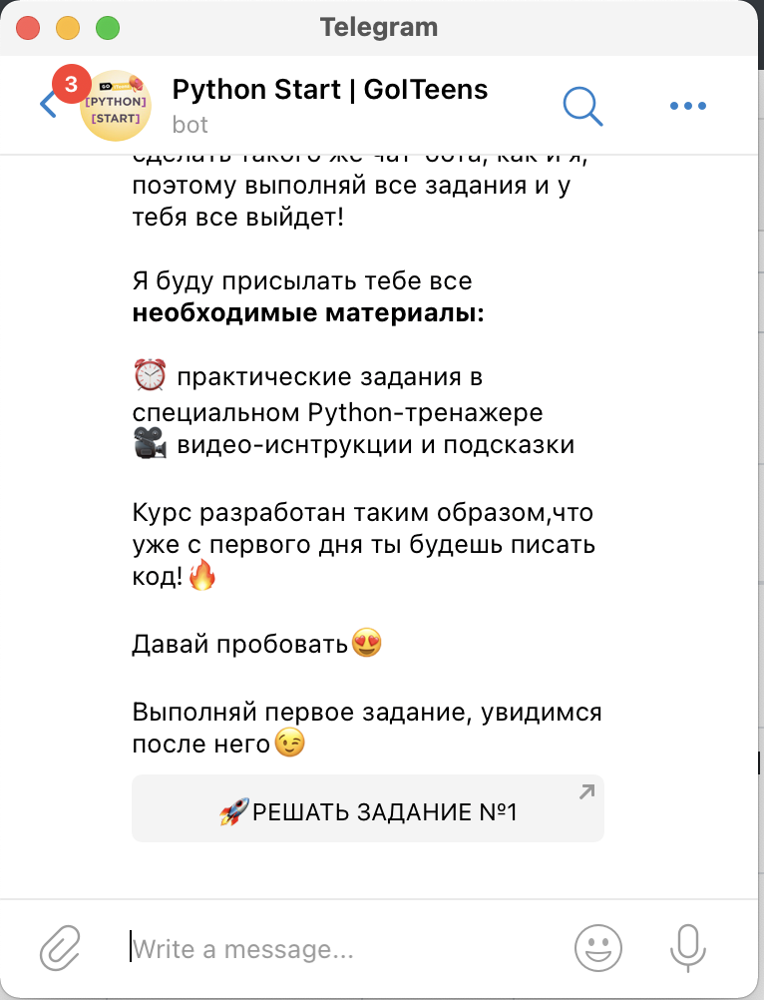   
Вам будет предложен переход по ссылке (с ним нужно согласиться)
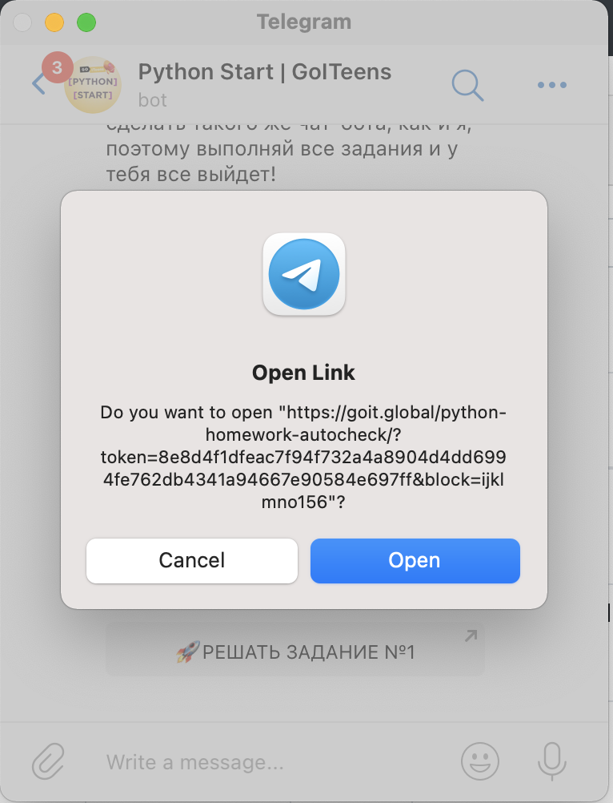   
Перед вами откроется Python-тренажер: специальная программа, в которой собрана теория, задания, возможность писать код и инструмент автоматической проверки написанного кода. Python-тренажер позволяет решать задачи и быстро получать обратную связь: правильно ли вы решили предложенную задачу.
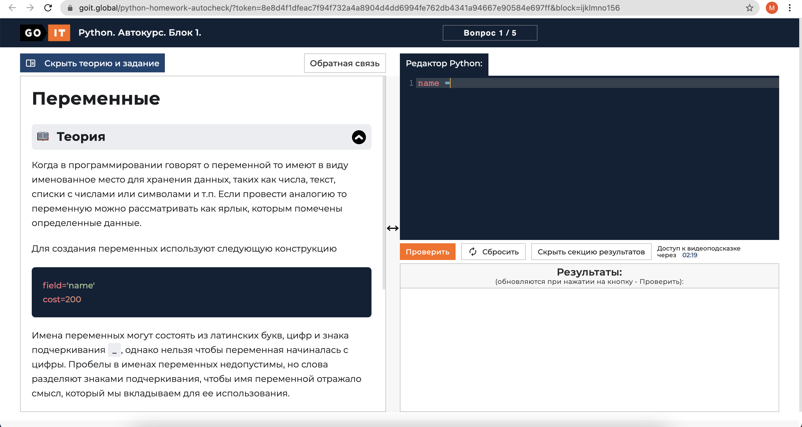   
В левой части экрана под блоком теории размещается текущее задание. Для выполнения задания необходимо написать код в **Редакторе Python** (правая верхняя часть экрана с темно-синим фоном). 
   

Если вы выполните задание неправильно - то в нижней части экрана (в левой части блока **"Результаты"**) красным цветом отображается те элементы программы, которые не соответствуют задания.
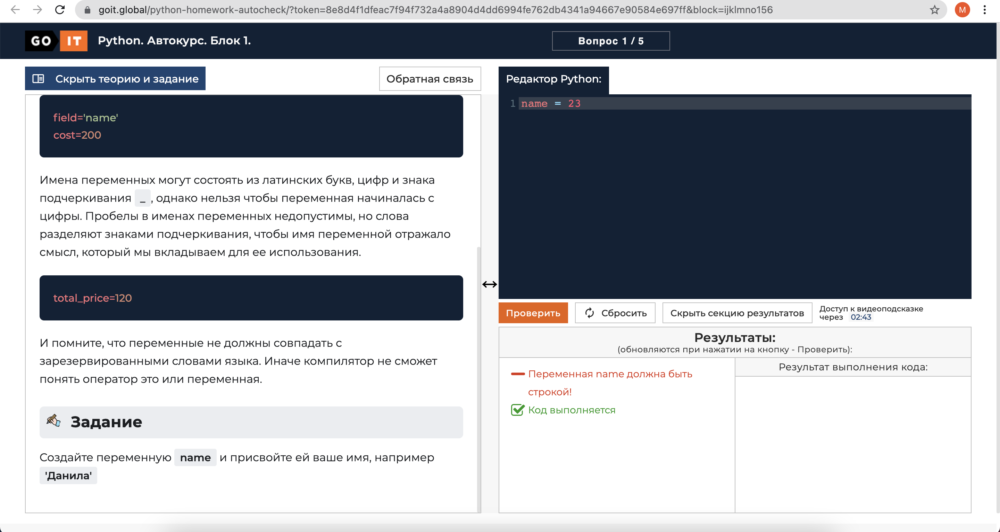   

Если задание выполнено верно - в блоке **"Результаты"** все сообщения будут зеленого цвета. Для перехода к следующе задаче необходимо нажать кнопку "Следующий вопрос"
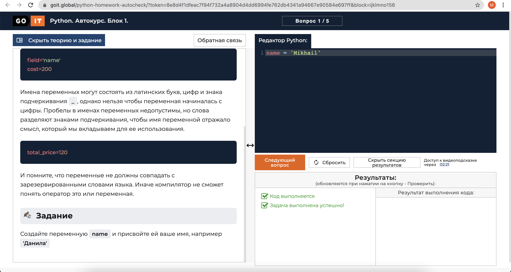   
Если вам не понятно решение - вы можете воспользоваться кнопкой "Видеоподсказка".
   
При нажатии кнопки "Видеоподсказка"  перед вами откроется окно с видеозаписью правильного решения.
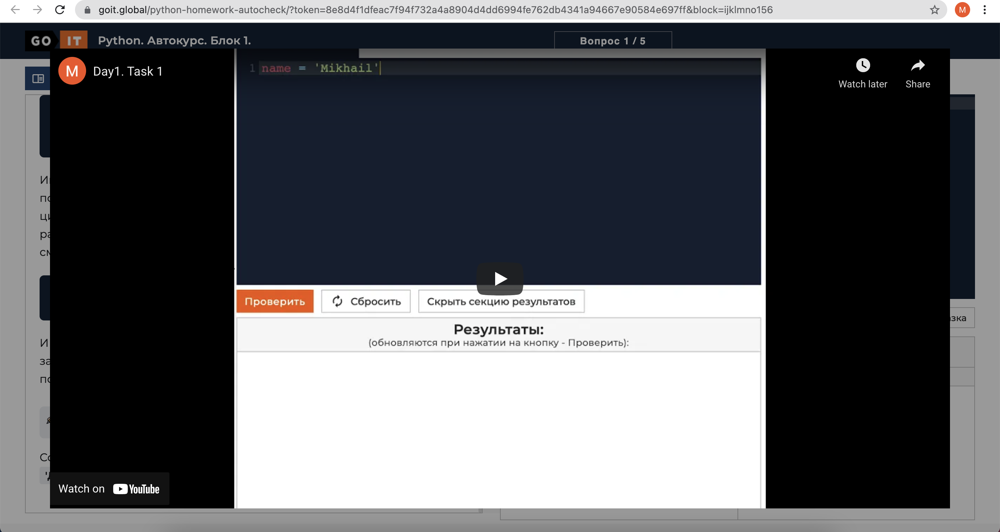   
После правильного выполнения последнего задания текущего дня выдано окно с поздравлениями
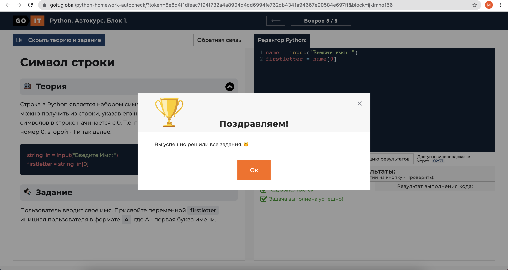   
После выполнения каждого последнего задания в текущем дне бот пришлет вам ссылку на бонусное задание (инструкцию по созданию бота, который реализует текущую функциональность задач Python-тренажера)  
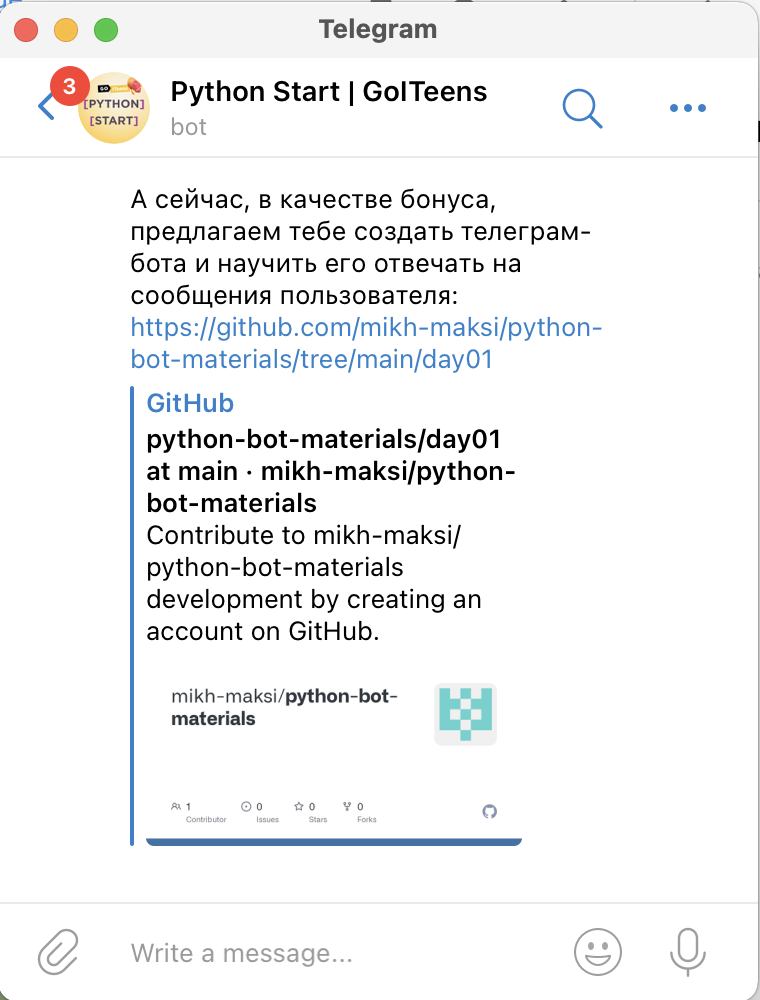   
Каждая инструкция - подробно описывает действия, которые необходимо выполнить чтобы реализовать в боте необходимую функциональность.
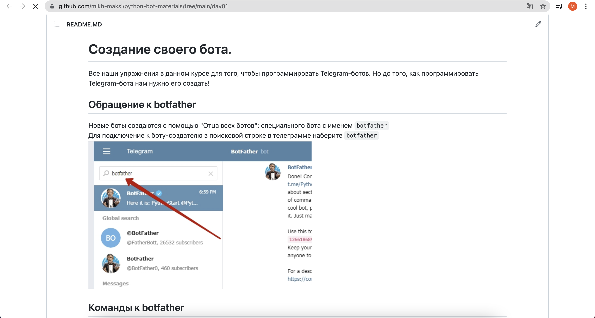   

