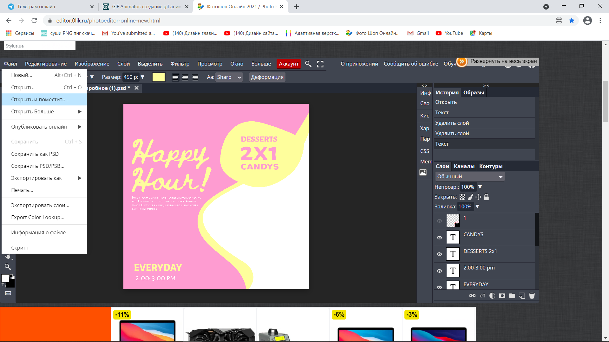
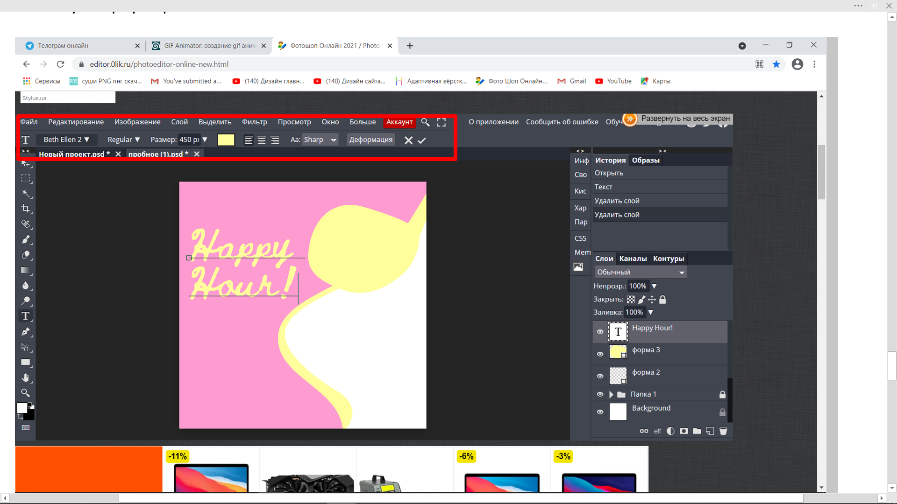
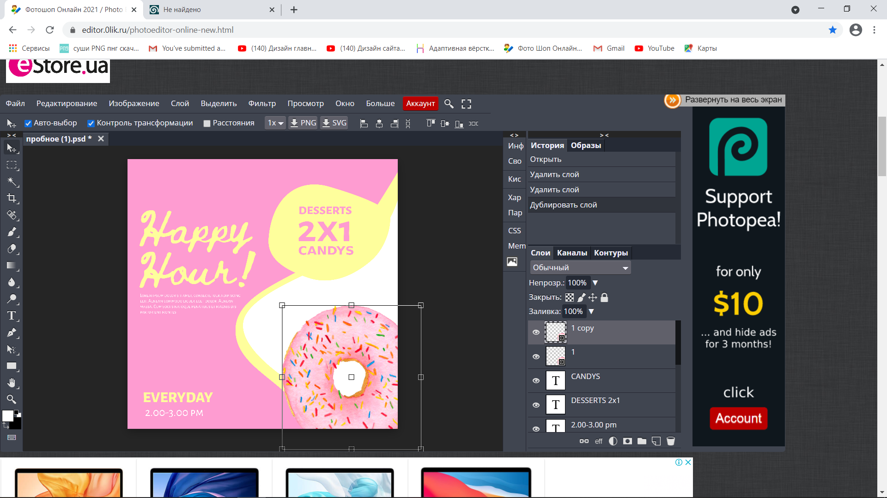
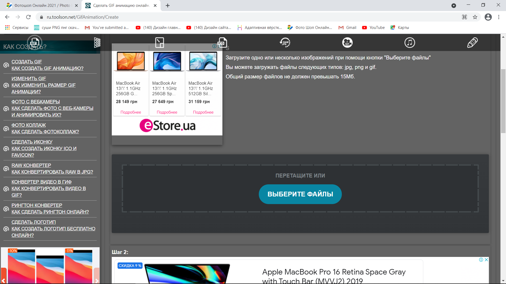

**ШАГ 1**
Открываем фотошоп по ссылке [https://www.photopea.com/](https://www.photopea.com/)  

**Шаг 2**
Нажимаем кнопку создать  

**Шаг 3**
В высоте и ширине указываем цифру 297 мм и расширение 300 пп  
   

Нажимаем кнопку создать
  
**Шаг 4** 
Берем инструмент ручка ( Р )  
  
  
**Шаг 5**  
Ставим точку за пределами монтажной области , ставим вторую точку выше и зажимаем ее направляем всплывшие линии по бокам.

**Шаг 6**  
Ставим следующую точку и повторяем действие 6   

**Шаг 7**  
Замыкаем фигуру- кликнув по точке с которой начинали  

**Шаг 8**
Ставим заливку. Наверху находиться цветной прямоугольник , нажимаем на него и выбираем единственный из предложенных квадратов –ПРЯМОУГОЛЬНИК и выбираем цвет- нажимаем на кнопку ок.
  

**Шаг 9**
Повторяем шаги 6,7,8,9 ( ТОЛЬКО , фигуру рисуем чуть дальше от предыдущей (со смещением вправо ) и меняем цвет на другой (похожий по тональности)

**Шаг 10**  

Переходим в папку слои с правой стороны и зажимаем верхний слой с новой фигурой, переносим ее под предыдущую, отпускаем клавишу.  

**Шаг 11**  
Берем снова инструмент ручка (Р) и рисуем круг, в котором будут большие цифры  
   
  
**Шаг 12**  
Далее пишем текст (Заголовок). Выбираем инструмент текст (Т) , ставим точку где хотим начать писать, сверху, слева изменяем его вид , размер и цвет,  пишем текст , нажимаем галочку сверху справа.  

  

**Шаг 13**  
Продолжаем наполнение текста таким же образом  
  
  
**Шаг 14**  
Переходим в папку *файл* , нажимаем *открыть и поместить*, помещаем картинку  
  
**Шаг 15**  
Переходим в *файл* и нажимаем экспортировать - в пнг   
сохраняем в папку на рабочем столе под названием *пончик*  
  

**Шаг 16**
Нажимаем Ctl+J для Копирования картинки  
  
  
**Шаг 17**
Нажимаем на глазик в предыдущем слои пончика  
  
**Шаг 18**
Нажимаем правой кнопкой по копии слоя пончика и нажимаем *растрирование*  

  
**Шаг 19**
Выбираем инструмент ласо и выделаем часть пончика (как будто бы его откусили) и нажимаем кнопку backspace, после нажимаем Ctrl+D, для снятия выделений

**Шаг 20**
Повторяем шаги с 15 по 20 ( копируем – убираем нижнего слоя видимость- обрезаем часть –сохраняем в пнг)  
повторяем два раз ( должно быть 4 картинки пончика в слоях )

**Шаг 21**
Переходим по ссылке  [https://ezgif.com/maker](https://ezgif.com/maker)
и нажимаем кнопку *выбрать файлы*, выбираем все картинки, сохранённые на рабочем столе в папке *пончик*

**Шаг 22**
Нажмем кнопку **"Upload and make a GIF!"**

**Шаг 23**
Изменим значение **Delay Time** на 100 (значение в милискундах, соответствует интервалу показу слайдов в 1 секунду).

**Шаг 24**
Сохраним созданную gif-анимацию 

**Шаг 25**
Нажимаем на кнопку *download* и сохраняем вашу работу на Компьютер
ВАША ГИФ АНИМАЦИЯ ГОТОВА !))

