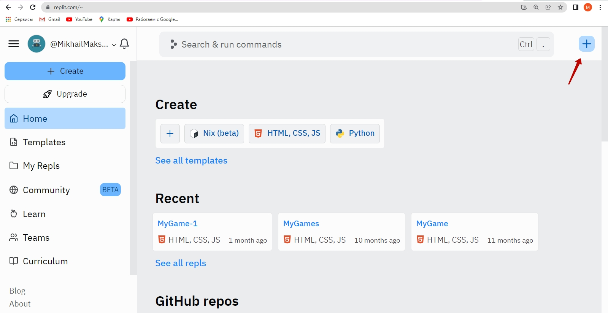
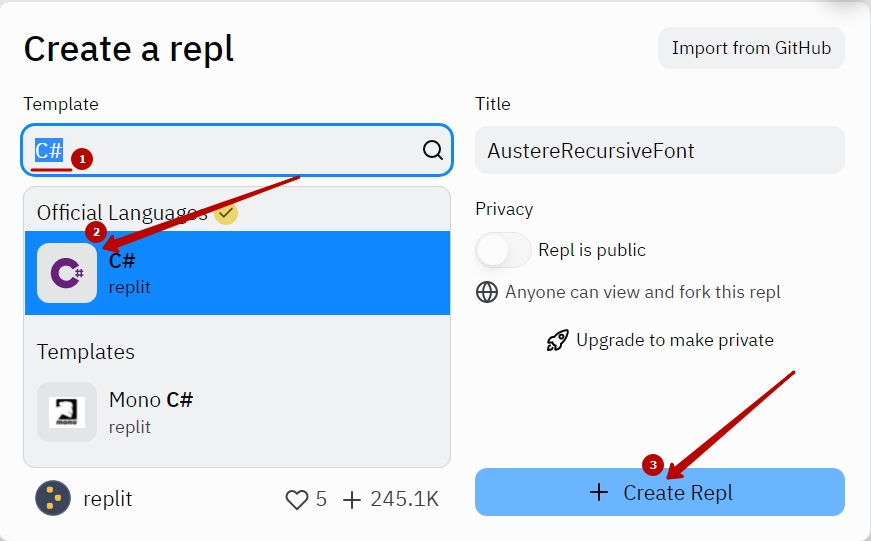
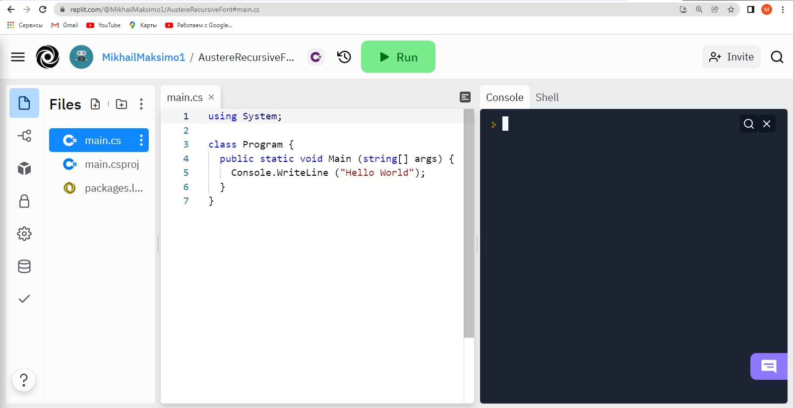
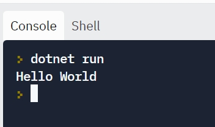
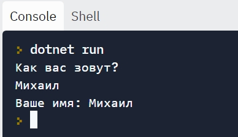
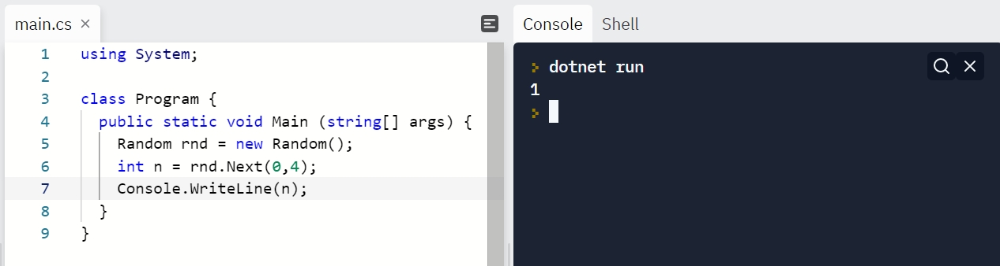

# GameDev
<br>
<br>
<br>
<br>

## Код по-умолчанию 
```C#
using System;

class Program {
  public static void Main (string[] args) {
    Console.WriteLine ("Hello World");
  }
}
```

<br>
<br>

## Ввод, вывод. Работа с переменной. 
```C#
using System;

class Program {
  public static void Main (string[] args) {
    Console.WriteLine ("Как вас зовут?");
    string name = Console.ReadLine();
    Console.WriteLine("Ваше имя: "+name);
  }
}
```
<br>

Данный код позволят разобраться с объектом **Console**. С помощью метода **WriteLine**, который выводит текст в консоль.


## Игра "Отгадай число"  

"Поиграем в игру": Загадайте число от 0 до 4. Я сейчас попробую угадать число. Если я угадаю - вы скажете "Угадал", если не угадаю - скажете "Не угадал" и скажете какое число угадали.  

### Загадаем случайное число.

```C#
using System;

class Program {
  public static void Main (string[] args) {
    Random rnd = new Random();
    int n = rnd.Next(0,4);
    Console.WriteLine(n);
  }
}
```



**Random rnd = new Random();** - создаем "переменную специального типа Random"  
**int n = rnd.Next(0,4);** - создаем числовую переменную **n**, которое получает случайное число, сгенерированное методом **Next**
**Console.WriteLine(n);** - выводим значение переменной **n** в консоль.