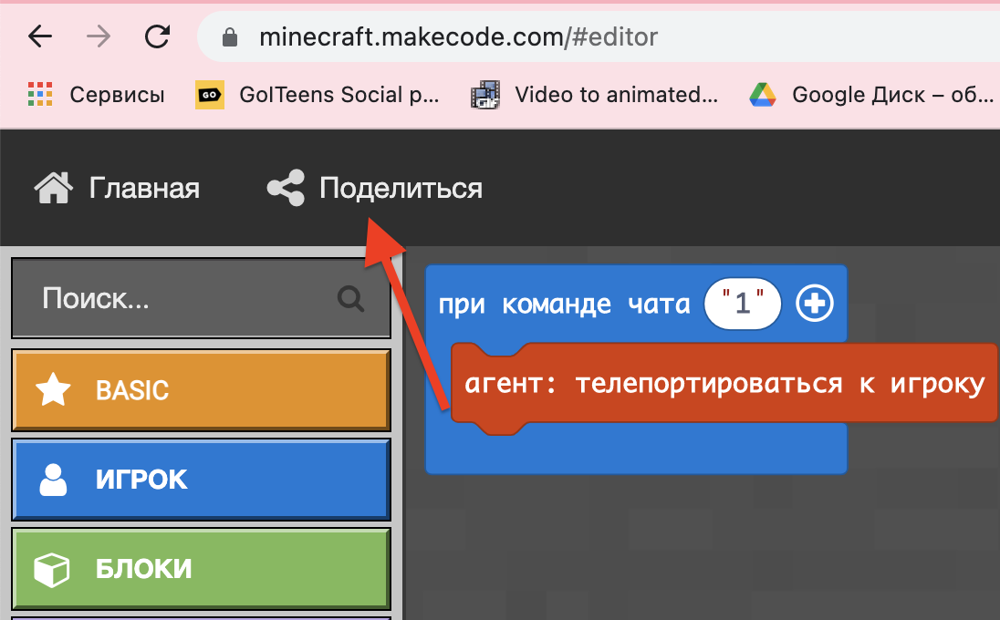
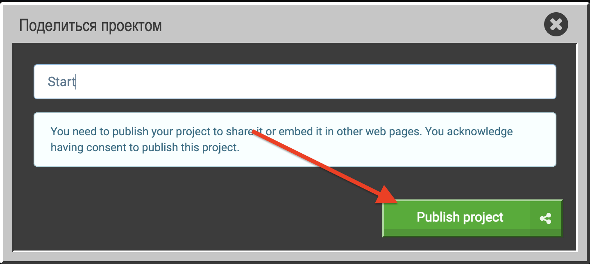
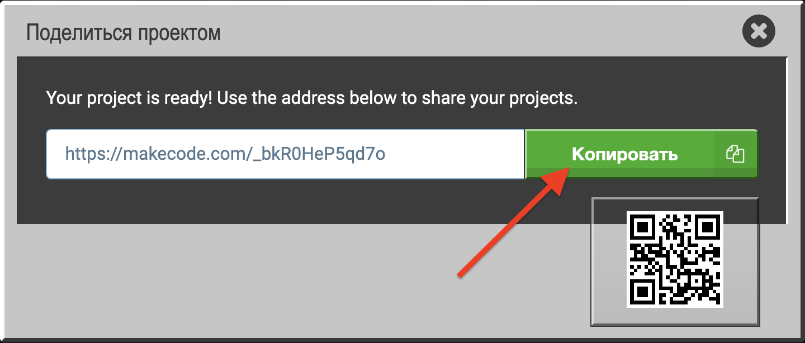
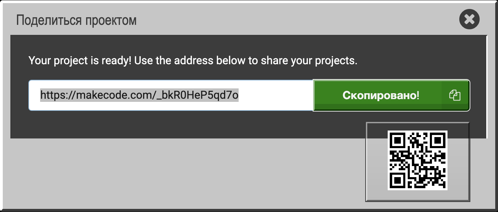
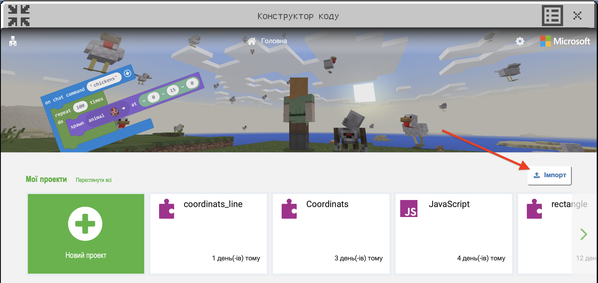
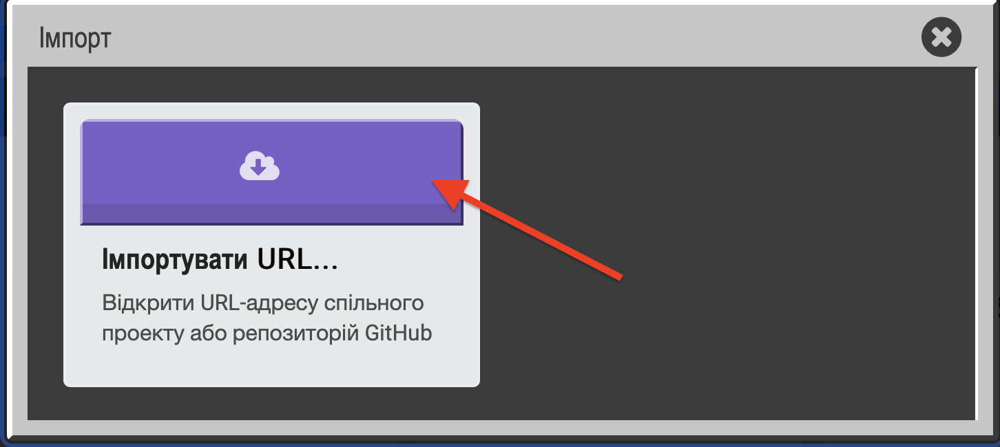
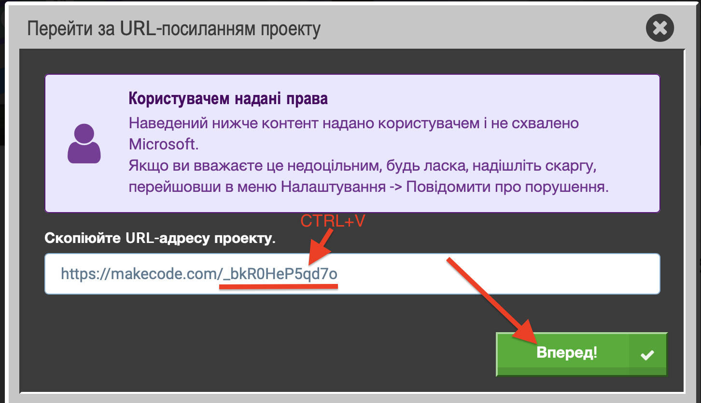
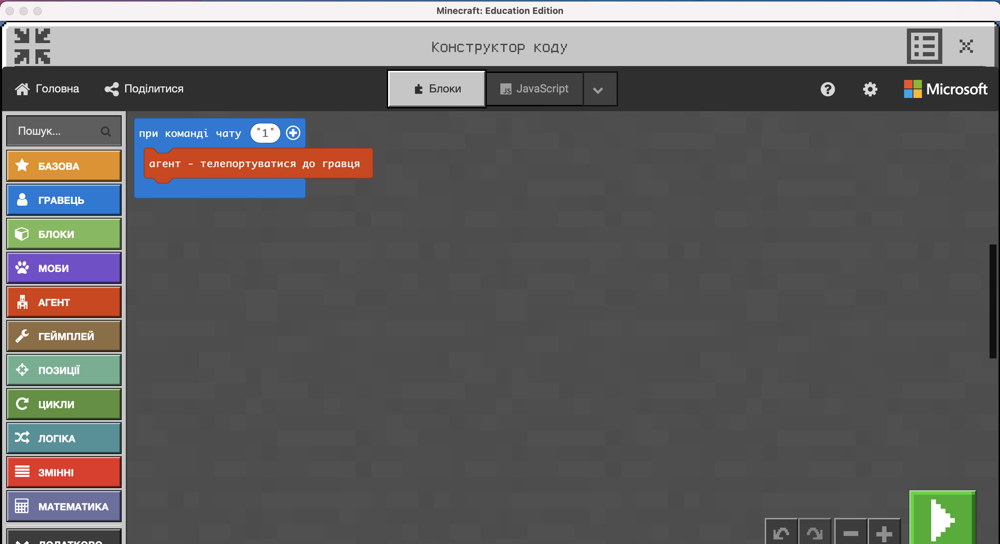

# Екстренні ситуації
1. Не працює Minecraft у дитини:
   - Дати керування своїм комп'ютером
   - Пройти програмування в он-лайн редакторі https://minecraft.makecode.com/ і далі - вставити у влсний minecraft та показати
  
  
  
  
  
  
  
  

   - Програмувати в середі [code.org/minecraft](https://code.org/minecraft)
