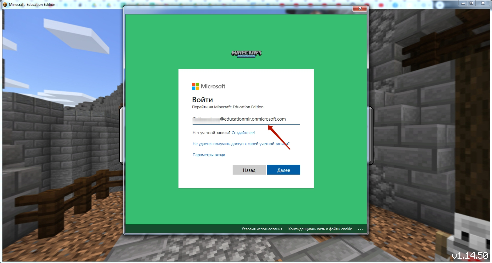
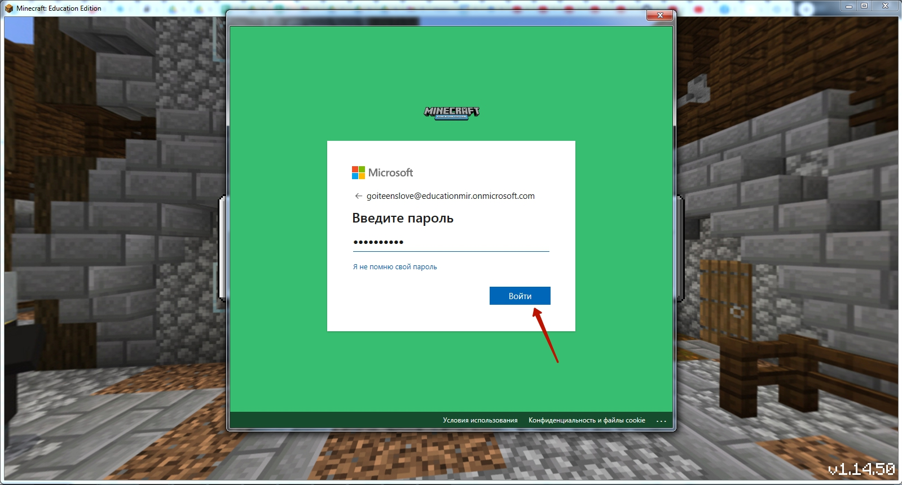
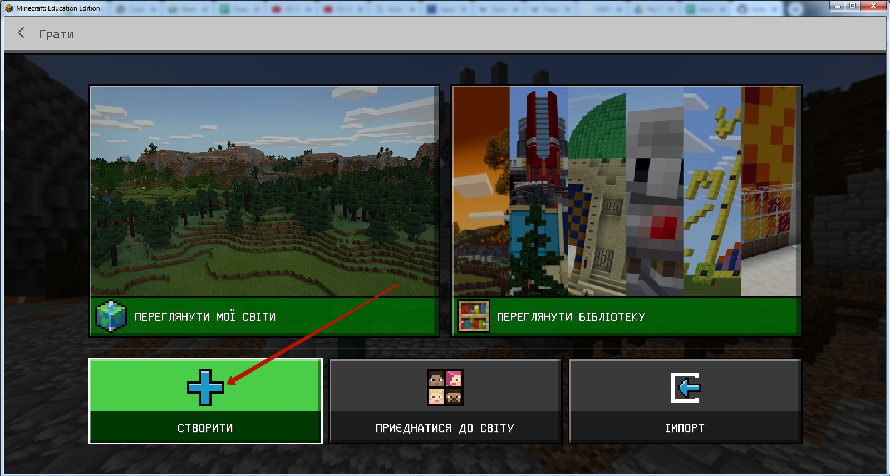
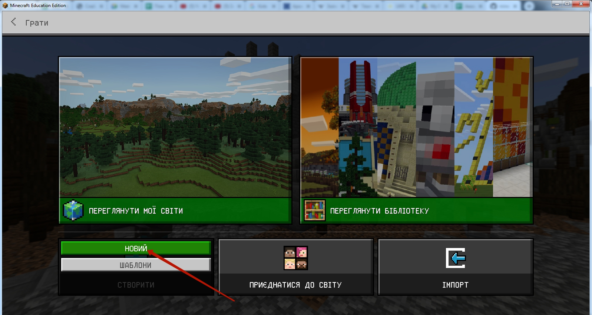
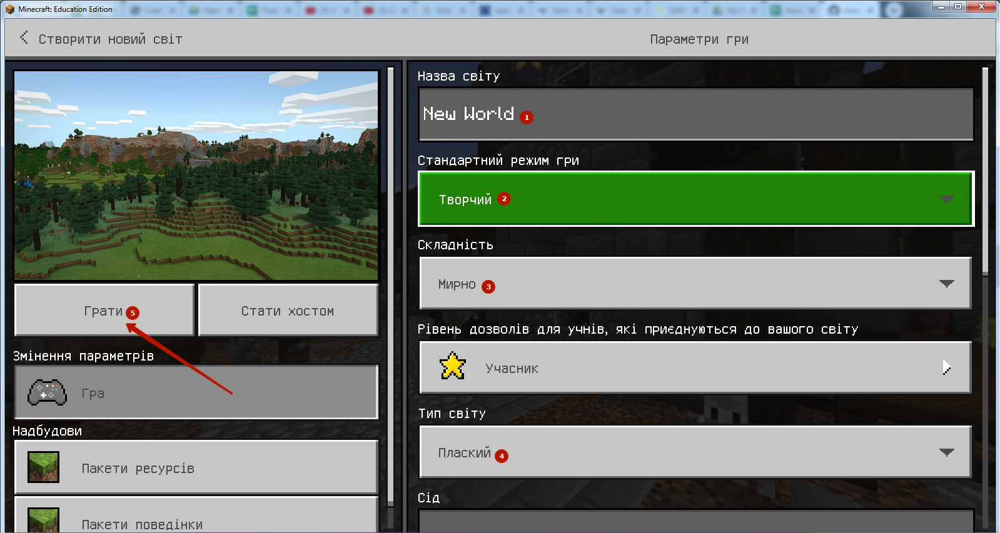
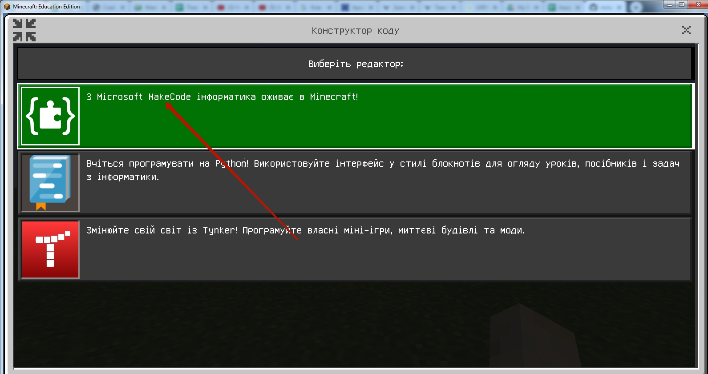
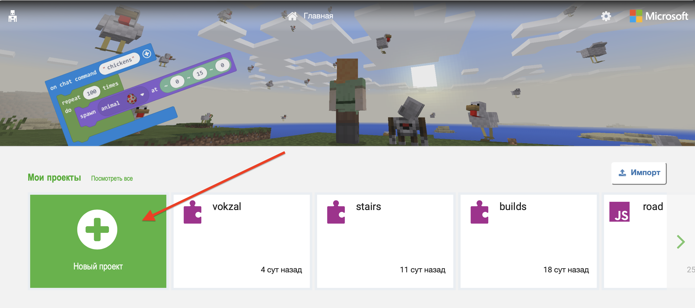
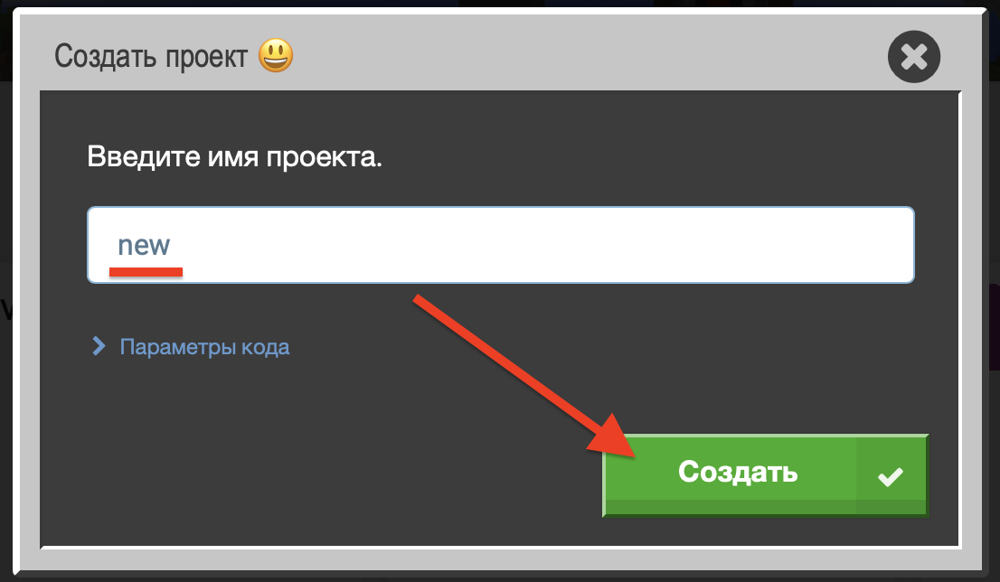
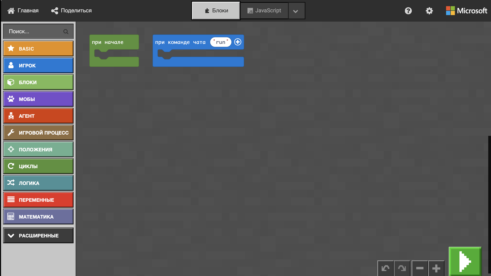

# Minecraft - вход
## Шаг 1. Вводим логин и пароль, которые вы получили от менеджера при регистрации.

## Шаг 2. Выбираем поле "Играть"

## Шаг 3. Создаем новый мир

  

## Шаг 4. Настраиваем новый мир

* Пишем название  
* Режим игры: **Творческий**
* Уровень сложности: **Мирно**
* Тип мира: **Плоский**
После настройки - нажимаем кнопку **"Играть"**

## Шаг 5. Включаем редакто кода (Code Builder) 

Нажимаем кнопку **C**    
Вбираем режим **"Microsoft Make Code"** - верхний в списке.  
  

Добавляем новый проект  
  

Добавляем название  

Получаем поле для программирования    
  