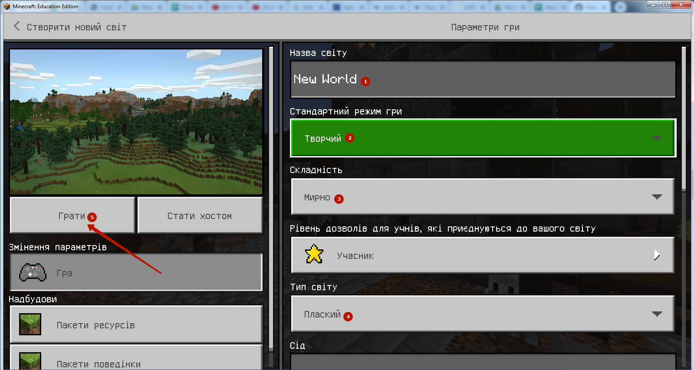
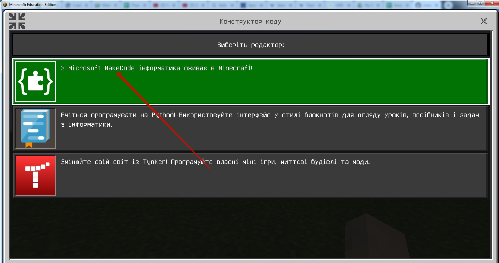
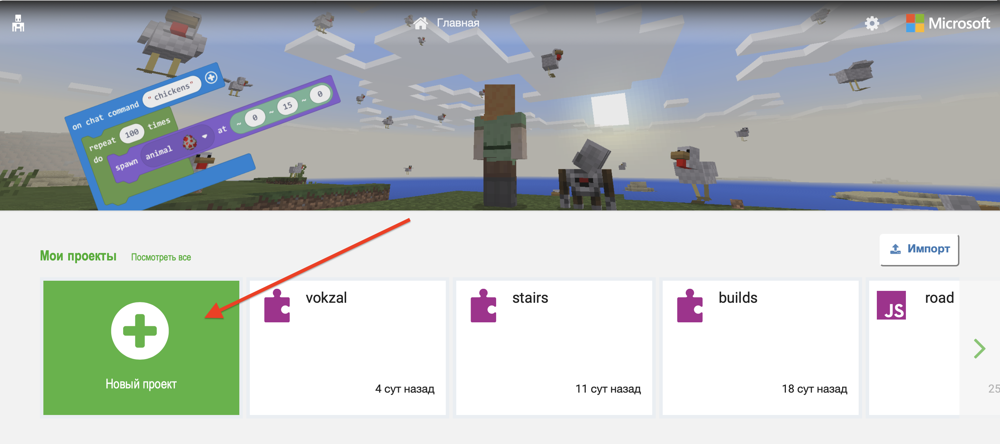
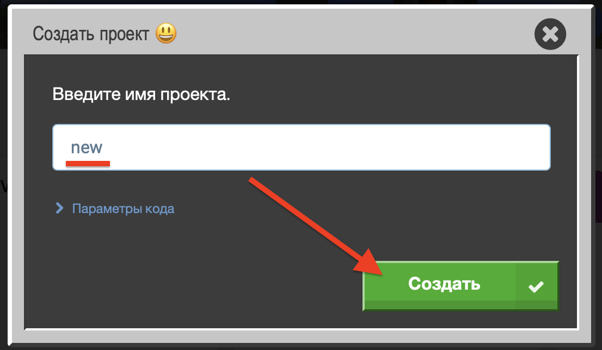

# Minecraft - вхід
Логін: GoiteensLove1@educationmir.onmicrosoft.com
Пароль: ASH2Sl9ziY

## Крок 1. Вводимо логін і пароль, які ви отримали від менеджера при реєстрації.

## Крок 2. Обираємо поле "Грати"

## Крок 3. Створюємо новий світ

  

## Крок 4. Налаштовуємо новий світ

* Пишемо назву 
* Режим гри: **Творчий**
* Рівень складності: **Мирно**
* Тип світу: **Плаский**
Після настройки - натискаємо кнопку **"Грати"**

## Крок 5. Включаємо редактор коду (Code Builder) 

Нажимаємо кнопку **C**    
Обираємо режим **"Microsoft Make Code"** - верхній в списку.  
  

Додаємо новий проект  
  

Додамо назву  

Отримаємо поле для програмування  
  

