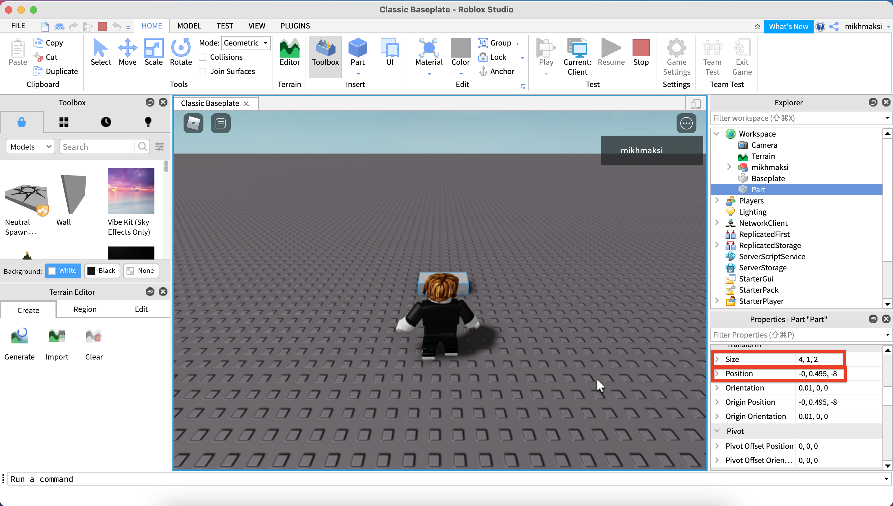
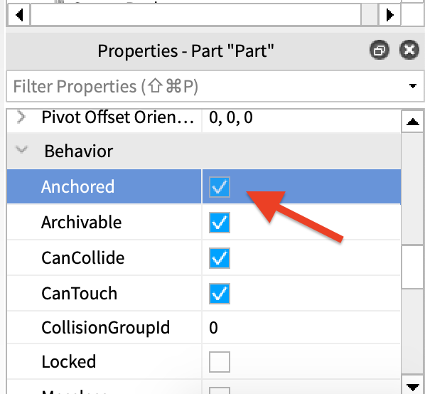

# Roblox
- Как тебя зовут? Меня - ...!
- Сколько тебе лет? О - круто!
- Мне сказали, что заинтересовался созданием игра, это правда? (чтобы активировать ребенка, кто он не сам пришел: не мама заставила)
- Расскажи, пожалуйста, что тебя заинтересовало?
- Выберем тип карты "Classic Baseplate"  
  

- Разберем элементы движка Roblox Studio  
  

- Двигаемся: W - вперед, D - вправо, A - влево, S - назад, пробел - прыжок.  
  

- Создадим элемент **Block** в разделе **Part**  
  

- Выберем установленный элемент **Block**  в списке всех элементов (**Explorer**)  
  

- Измененим свойства: **size** и **position**  
  
  
  
  

- Сделаем созданный куб красного цвета и типом материала Neon  
  
  

- Доавим элемент интерфеса (текстовую кнопку): нажмем кнопку **UI**, далее **ScreenGUI** и **TextButton**
  
  

- Поменяем текст на кнопке на **Boom!!!**   
  

- Добавим элемент кнопки **LocalScript**  
  
 

- В элементе **LocalScript** удалим исходное значение *print("Hello world!")* и вставим <a href = "https://github.com/mikh-maksi/roblox-probe/blob/main/lesson/BUTTONPROBE.MD">код взрыва</a> 
  
  

- Перейдем на вкладку **Classic Baseplate**  
  

- Запустим игру  
  

- Выберем модель зомби (**Zombie**)  
  

- Выберем модель **Drobling Zoombie**   
    
    
  
     
    
    
- Запустим игру  
  

- Поиграем  
  

