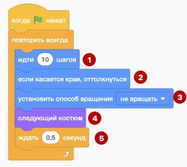
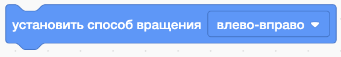
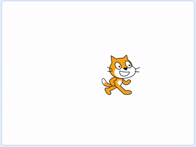
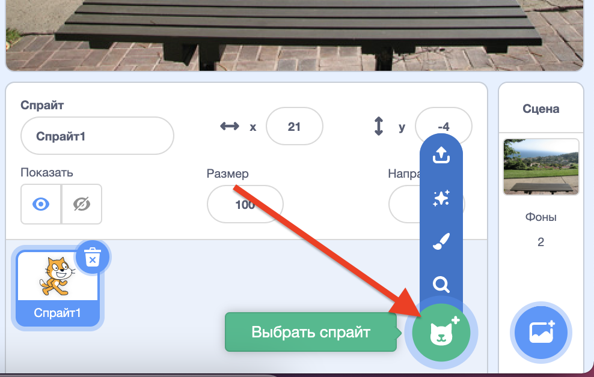
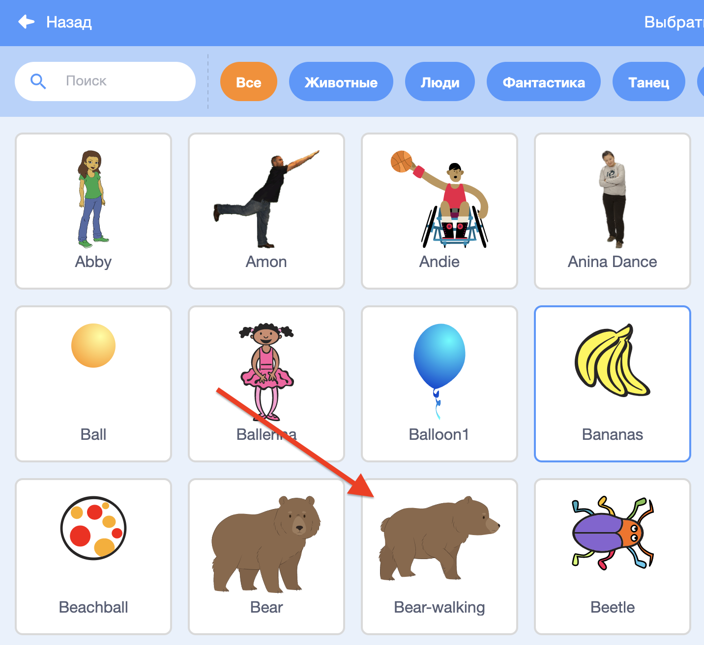
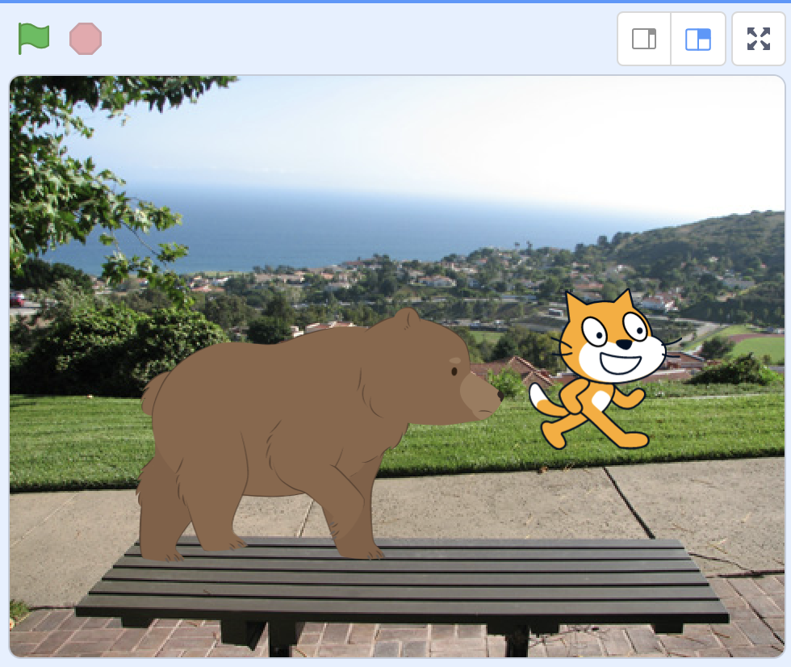

# Scratch
## Введение
- Привет!
- Сейчас мы с вами сделаем свою анимационную историю: научим котика и других зверей ходить и бегать по лесу
- Меня зовут ... Я - преподаватель.
- Расскажите, как вас зовут, откуда вы и почему пришли на данный курс 
## Основная часть
- Давай запрограммируем котика:   
Необходимо собрать заготовленные блоки:  
  <a href = "https://scratch.mit.edu/projects/566707993/editor/">Котик бегает</a>  
В следующей последовательности (при добавлении каждого нового блока делать запуск):  
    
  
(+ изменив параметр)  
  

В результате получим следующий результат:  
  

**Дополнительные элементы (если студент продвинутый):**  
- Добавим фон (студент выбирает сам фон):  

- Добавим еще одного персонажа:  

- мы показали тебе, как проходят занятия: на каждом уроке мы разбираем интересный элемент и делаем анимационные истории и игры.
 
